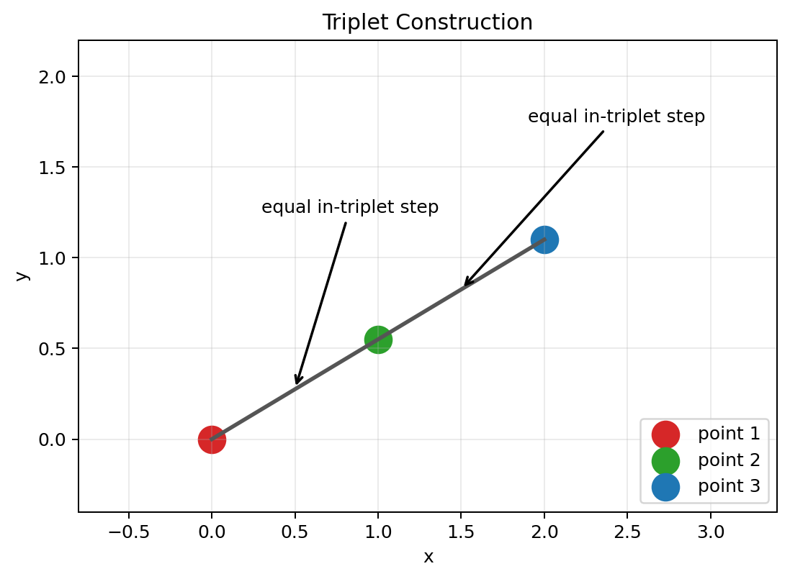
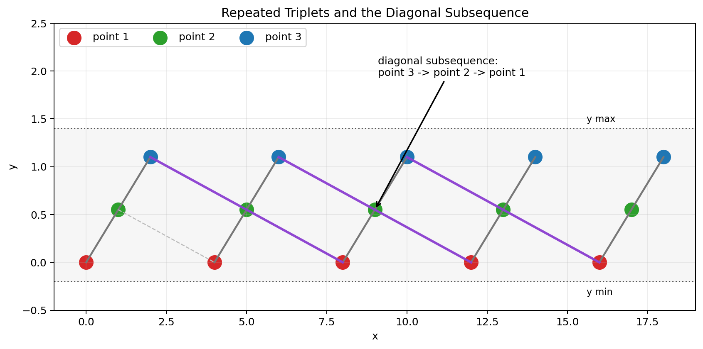

# structured-latent-hypothesis

Structured experiments around the **Commutative Flatness Prior (CFP)**:

> if useful representations are locally additive across independent factors, then penalizing mixed finite differences should improve compositional generalization.

This repository starts from a simple geometric observation and turns it into a falsifiable ML hypothesis. The current focus is deliberately narrow:

1. validate CFP on synthetic worlds where factors are commutative,
2. test negative controls where the factors are order-sensitive,
3. measure whether the gain is specific to commutative structure rather than generic smoothness.

## Working Hypothesis

For a latent grid `z_{n,k}`, CFP encourages:

`Delta_i Delta_j z ~= 0`

which is the discrete statement that factor steps approximately commute. In the exact case, this implies an additive decomposition:

`z_n = c + sum_i g_i(n_i)`

The repository does **not** assume this replaces dense layers or standard optimizers. The practical claim is narrower:

- CFP may act as a useful inductive bias for structured latent spaces.
- It should help most when data factors are approximately compositional.
- It should help less, or fail cleanly, on non-commutative controls.

## Origin Sketch

The project started from a simple repeated-point construction rendered directly from code:





## What Is Implemented

- `docs/research_note.md`: condensed statement of the hypothesis, claims, and evaluation rules.
- `src/structured_latent_hypothesis/synthetic.py`: synthetic benchmarks and CFP regularizers.
- `scripts/run_synthetic.py`: initial baseline benchmark.
- `scripts/run_cfp_sweep.py`: lambda sweep with holdout-cell diagnostics.
- `scripts/run_commutator_ladder.py`: matched-family ladders with ground-truth commutator metadata.
- `scripts/render_origin_figures.py`: reproducible origin figures for the repository.

The current benchmark families include:

- `commutative`: horizontal translation + brightness scaling
- `noncommutative`: asymmetric spatial windowing + rotation
- `matched ramp ladder`: horizontal shift + position-dependent intensity ramp
- `matched scale ladder`: horizontal shift + center scaling

## Quick Start

```powershell
python -m venv .venv
.venv\Scripts\python -m pip install --upgrade pip
.venv\Scripts\python -m pip install -e .
.venv\Scripts\python .\scripts\render_origin_figures.py
.venv\Scripts\python .\scripts\run_synthetic.py --output-json .\results\initial_synthetic.json --output-markdown .\results\initial_synthetic.md
```

## Success Criteria

The claim is supported only if CFP:

- improves held-out composition performance in commutative or near-commutative worlds,
- reduces commutativity error,
- remains stable across several seeds,
- loses the advantage as true non-commutativity grows.

If the prior helps both worlds equally, it is probably acting as generic smoothing rather than as a structure-aware bias.
