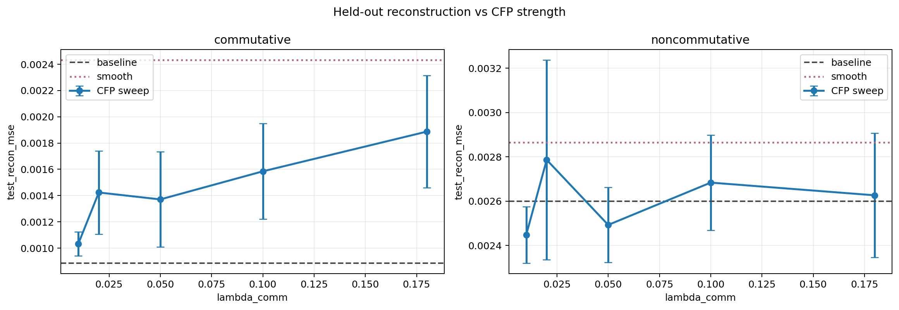
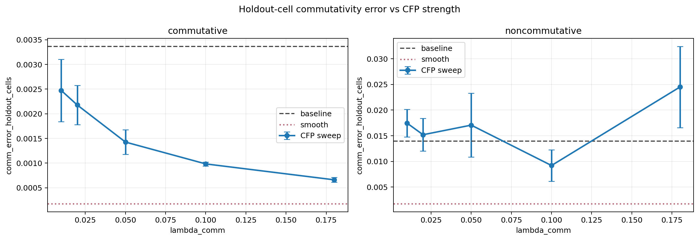
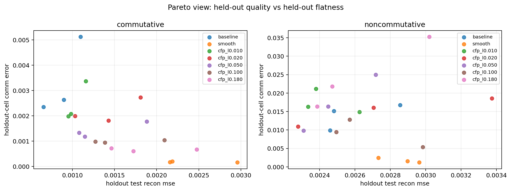
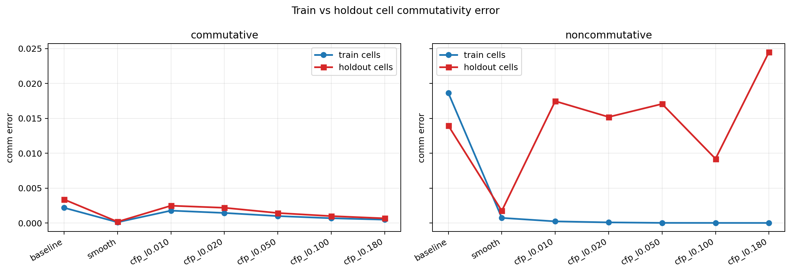
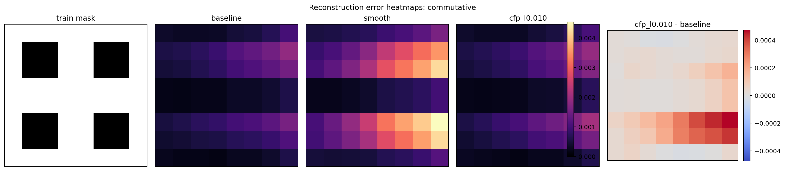
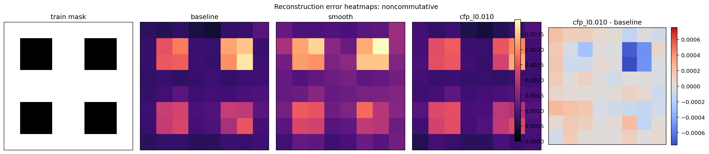

# CFP Lambda Sweep

Split strategy: `cartesian_blocks`

## Observations

- `commutative`: best CFP variant is `cfp_l0.010` with test recon `0.001031` versus baseline `0.000884`.
- `noncommutative`: best CFP variant is `cfp_l0.010` with test recon `0.002447` versus baseline `0.002599`.

## Plots

