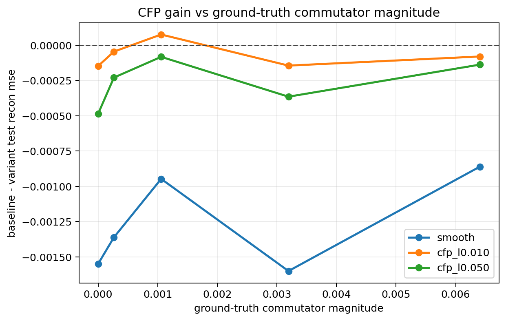
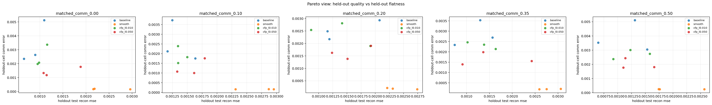
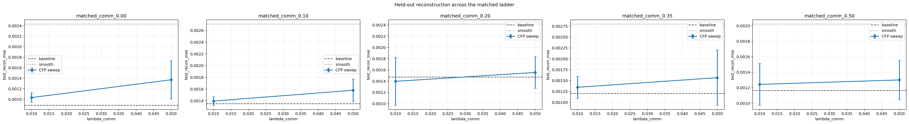

# Matched Commutator Ladder (ramp)

Split strategy: `cartesian_blocks`

## Observations

- `matched_comm_0.00`: commutator `0.000000`, baseline `0.000884`, cfp_l0.010 `0.001031`, cfp_l0.050 `0.001370`.
- `matched_comm_0.10`: commutator `0.000266`, baseline `0.001350`, cfp_l0.010 `0.001396`, cfp_l0.050 `0.001579`.
- `matched_comm_0.20`: commutator `0.001059`, baseline `0.001473`, cfp_l0.010 `0.001396`, cfp_l0.050 `0.001555`.
- `matched_comm_0.35`: commutator `0.003195`, baseline `0.001202`, cfp_l0.010 `0.001346`, cfp_l0.050 `0.001567`.
- `matched_comm_0.50`: commutator `0.006405`, baseline `0.001163`, cfp_l0.010 `0.001243`, cfp_l0.050 `0.001301`.

## Plots

