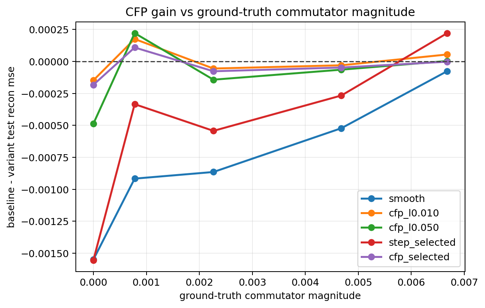
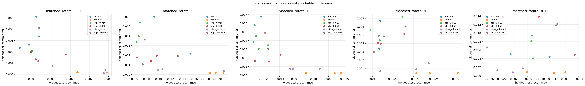
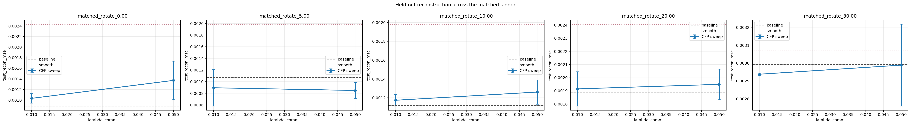

# Matched Commutator Ladder (rotation)

Split strategy: `cartesian_blocks`
Selection mode: `nested`

## Observations

- `matched_rotate_0.00`: commutator `0.000000`, baseline `0.000884`, smooth `0.002434`, cfp_l0.010 `0.001031`, cfp_l0.050 `0.001370`, step_selected `0.002438` (step_candidate_l0.005 x2, step_candidate_l0.050 x1), cfp_selected `0.001067` (cfp_candidate_l0.005 x1, cfp_candidate_l0.010 x1, cfp_candidate_l0.050 x1).
- `matched_rotate_5.00`: commutator `0.000778`, baseline `0.001071`, smooth `0.001988`, cfp_l0.010 `0.000895`, cfp_l0.050 `0.000849`, step_selected `0.001405` (step_candidate_l0.005 x1, step_candidate_l0.010 x2), cfp_selected `0.000962` (cfp_candidate_l0.010 x1, cfp_candidate_l0.020 x1, cfp_candidate_l0.100 x1).
- `matched_rotate_10.00`: commutator `0.002266`, baseline `0.001118`, smooth `0.001983`, cfp_l0.010 `0.001173`, cfp_l0.050 `0.001261`, step_selected `0.001661` (step_candidate_l0.005 x3), cfp_selected `0.001195` (cfp_candidate_l0.005 x1, cfp_candidate_l0.020 x1, cfp_candidate_l0.050 x1).
- `matched_rotate_20.00`: commutator `0.004680`, baseline `0.001885`, smooth `0.002407`, cfp_l0.010 `0.001915`, cfp_l0.050 `0.001949`, step_selected `0.002151` (step_candidate_l0.005 x3), cfp_selected `0.001932` (cfp_candidate_l0.005 x2, cfp_candidate_l0.100 x1).
- `matched_rotate_30.00`: commutator `0.006678`, baseline `0.002992`, smooth `0.003068`, cfp_l0.010 `0.002938`, cfp_l0.050 `0.002989`, step_selected `0.002771` (step_candidate_l0.005 x3), cfp_selected `0.002994` (cfp_candidate_l0.005 x1, cfp_candidate_l0.020 x1, cfp_candidate_l0.050 x1).

## Plots

