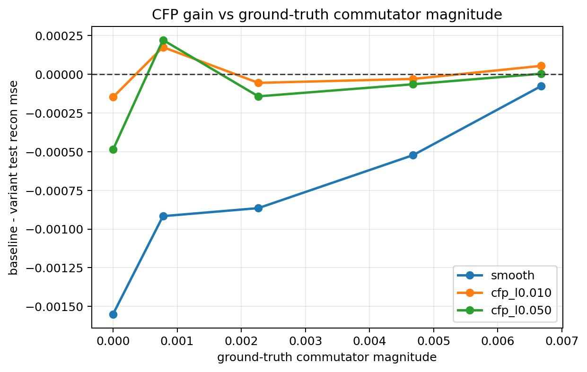
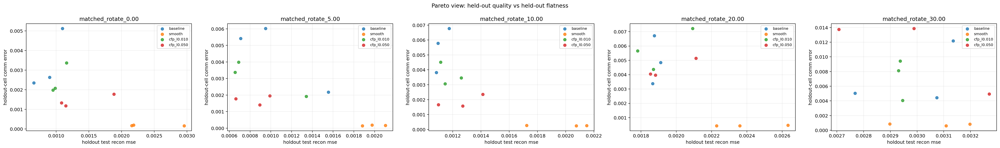

# Matched Commutator Ladder (rotation)

Split strategy: `cartesian_blocks`

## Observations

- `matched_rotate_0.00`: commutator `0.000000`, baseline `0.000884`, cfp_l0.010 `0.001031`, cfp_l0.050 `0.001370`.
- `matched_rotate_5.00`: commutator `0.000778`, baseline `0.001071`, cfp_l0.010 `0.000895`, cfp_l0.050 `0.000849`.
- `matched_rotate_10.00`: commutator `0.002266`, baseline `0.001118`, cfp_l0.010 `0.001173`, cfp_l0.050 `0.001261`.
- `matched_rotate_20.00`: commutator `0.004680`, baseline `0.001885`, cfp_l0.010 `0.001915`, cfp_l0.050 `0.001949`.
- `matched_rotate_30.00`: commutator `0.006678`, baseline `0.002992`, cfp_l0.010 `0.002938`, cfp_l0.050 `0.002989`.

## Plots

