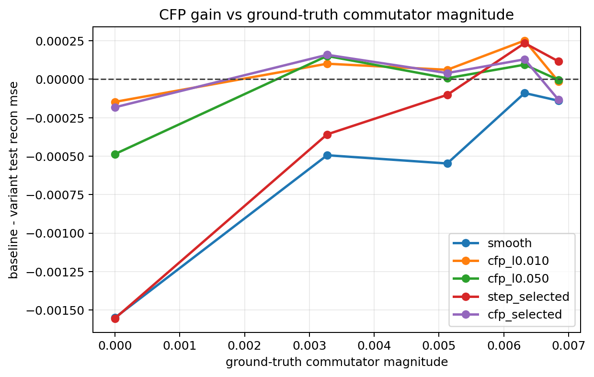
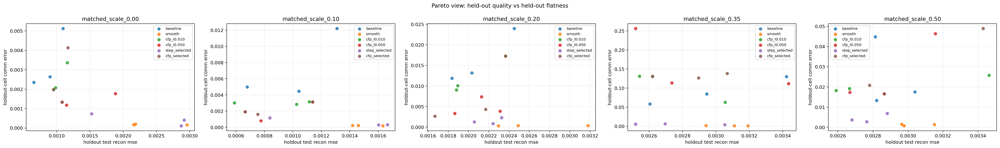

# Matched Commutator Ladder (scale)

Split strategy: `cartesian_blocks`
Selection mode: `nested`

## Observations

- `matched_scale_0.00`: commutator `0.000000`, baseline `0.000884`, smooth `0.002434`, cfp_l0.010 `0.001031`, cfp_l0.050 `0.001370`, step_selected `0.002438` (step_candidate_l0.005 x2, step_candidate_l0.050 x1), cfp_selected `0.001067` (cfp_candidate_l0.005 x1, cfp_candidate_l0.010 x1, cfp_candidate_l0.050 x1).
- `matched_scale_0.10`: commutator `0.003273`, baseline `0.001010`, smooth `0.001504`, cfp_l0.010 `0.000910`, cfp_l0.050 `0.000859`, step_selected `0.001369` (step_candidate_l0.005 x1, step_candidate_l0.020 x2), cfp_selected `0.000852` (cfp_candidate_l0.020 x1, cfp_candidate_l0.050 x2).
- `matched_scale_0.20`: commutator `0.005126`, baseline `0.002107`, smooth `0.002655`, cfp_l0.010 `0.002046`, cfp_l0.050 `0.002101`, step_selected `0.002209` (step_candidate_l0.005 x3), cfp_selected `0.002067` (cfp_candidate_l0.010 x1, cfp_candidate_l0.100 x2).
- `matched_scale_0.35`: commutator `0.006321`, baseline `0.002991`, smooth `0.003081`, cfp_l0.010 `0.002740`, cfp_l0.050 `0.002897`, step_selected `0.002757` (step_candidate_l0.005 x2, step_candidate_l0.010 x1), cfp_selected `0.002862` (cfp_candidate_l0.010 x1, cfp_candidate_l0.020 x1, cfp_candidate_l0.100 x1).
- `matched_scale_0.50`: commutator `0.006843`, baseline `0.002891`, smooth `0.003031`, cfp_l0.010 `0.002906`, cfp_l0.050 `0.002896`, step_selected `0.002776` (step_candidate_l0.005 x2, step_candidate_l0.010 x1), cfp_selected `0.003025` (cfp_candidate_l0.005 x1, cfp_candidate_l0.020 x1, cfp_candidate_l0.050 x1).

## Plots

