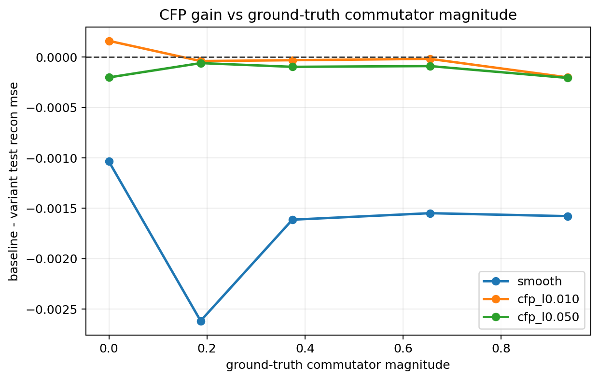
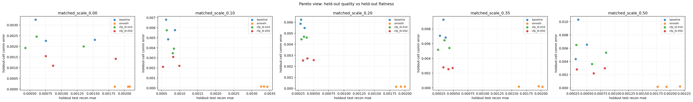
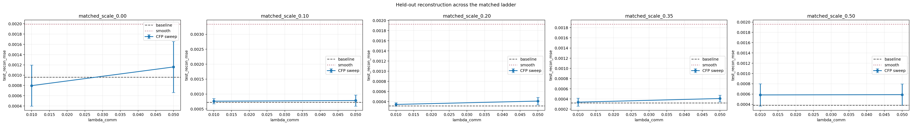

# Matched Commutator Ladder V1 (scale)

Split strategy: `cartesian_blocks`

## Observations

- `matched_scale_0.00`: commutator `0.000000`, baseline `0.000958`, cfp_l0.010 `0.000796`, cfp_l0.050 `0.001160`.
- `matched_scale_0.10`: commutator `0.187083`, baseline `0.000722`, cfp_l0.010 `0.000761`, cfp_l0.050 `0.000781`.
- `matched_scale_0.20`: commutator `0.374166`, baseline `0.000314`, cfp_l0.010 `0.000345`, cfp_l0.050 `0.000411`.
- `matched_scale_0.35`: commutator `0.654790`, baseline `0.000320`, cfp_l0.010 `0.000337`, cfp_l0.050 `0.000409`.
- `matched_scale_0.50`: commutator `0.935414`, baseline `0.000382`, cfp_l0.010 `0.000583`, cfp_l0.050 `0.000588`.

## Plots

