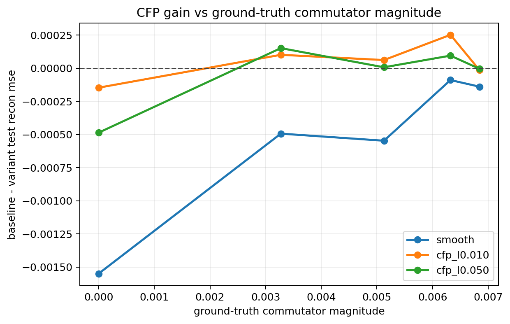
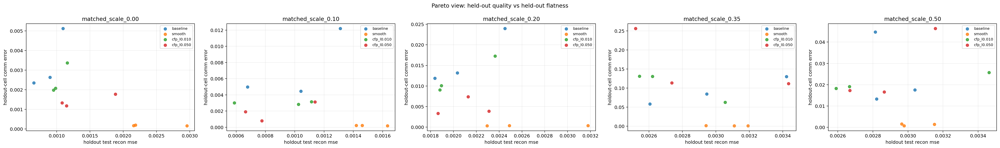
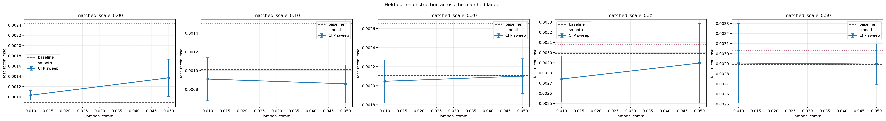

# Matched Commutator Ladder (scale)

Split strategy: `cartesian_blocks`

## Observations

- `matched_scale_0.00`: commutator `0.000000`, baseline `0.000884`, cfp_l0.010 `0.001031`, cfp_l0.050 `0.001370`.
- `matched_scale_0.10`: commutator `0.003273`, baseline `0.001010`, cfp_l0.010 `0.000910`, cfp_l0.050 `0.000859`.
- `matched_scale_0.20`: commutator `0.005126`, baseline `0.002107`, cfp_l0.010 `0.002046`, cfp_l0.050 `0.002101`.
- `matched_scale_0.35`: commutator `0.006321`, baseline `0.002991`, cfp_l0.010 `0.002740`, cfp_l0.050 `0.002897`.
- `matched_scale_0.50`: commutator `0.006843`, baseline `0.002891`, cfp_l0.010 `0.002906`, cfp_l0.050 `0.002896`.

## Plots

