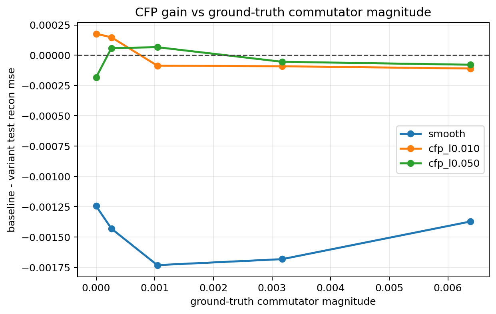
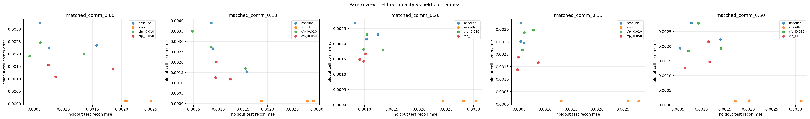
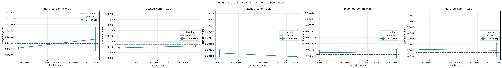

# Matched Commutator Ladder V1

Split strategy: `cartesian_blocks`

## Observations

- `matched_comm_0.00`: commutator `0.000000`, baseline `0.000972`, cfp_l0.010 `0.000794`, cfp_l0.050 `0.001154`.
- `matched_comm_0.10`: commutator `0.000261`, baseline `0.001108`, cfp_l0.010 `0.000960`, cfp_l0.050 `0.001049`.
- `matched_comm_0.20`: commutator `0.001043`, baseline `0.001034`, cfp_l0.010 `0.001120`, cfp_l0.050 `0.000968`.
- `matched_comm_0.35`: commutator `0.003174`, baseline `0.000553`, cfp_l0.010 `0.000644`, cfp_l0.050 `0.000607`.
- `matched_comm_0.50`: commutator `0.006382`, baseline `0.000916`, cfp_l0.010 `0.001025`, cfp_l0.050 `0.000994`.

## Plots

