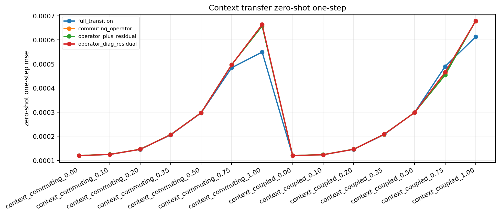
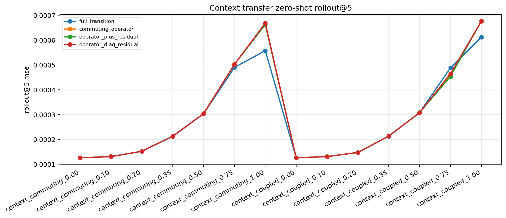
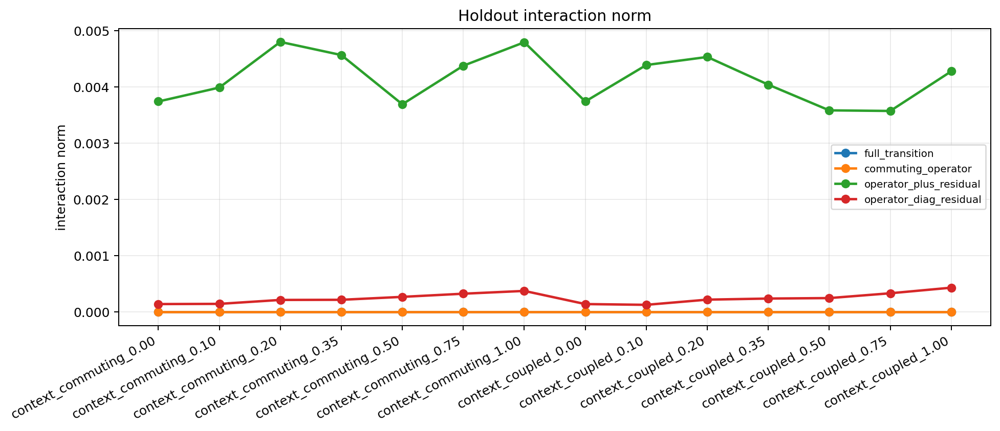

# Context Operator Probe v1

Split strategy: `holdout_context`

## Observations

- `context_commuting_0.00`: family `commuting`, coupling `0.00`, full `0.000120`, commuting `0.000120`, plus_resid `0.000120`, diag_resid `0.000120`.
- `context_commuting_0.10`: family `commuting`, coupling `0.10`, full `0.000124`, commuting `0.000125`, plus_resid `0.000125`, diag_resid `0.000125`.
- `context_commuting_0.20`: family `commuting`, coupling `0.20`, full `0.000146`, commuting `0.000146`, plus_resid `0.000146`, diag_resid `0.000146`.
- `context_commuting_0.35`: family `commuting`, coupling `0.35`, full `0.000206`, commuting `0.000207`, plus_resid `0.000207`, diag_resid `0.000207`.
- `context_commuting_0.50`: family `commuting`, coupling `0.50`, full `0.000297`, commuting `0.000298`, plus_resid `0.000298`, diag_resid `0.000298`.
- `context_commuting_0.75`: family `commuting`, coupling `0.75`, full `0.000484`, commuting `0.000497`, plus_resid `0.000497`, diag_resid `0.000497`.
- `context_commuting_1.00`: family `commuting`, coupling `1.00`, full `0.000549`, commuting `0.000662`, plus_resid `0.000657`, diag_resid `0.000663`.
- `context_coupled_0.00`: family `coupled`, coupling `0.00`, full `0.000120`, commuting `0.000120`, plus_resid `0.000120`, diag_resid `0.000120`.
- `context_coupled_0.10`: family `coupled`, coupling `0.10`, full `0.000123`, commuting `0.000124`, plus_resid `0.000124`, diag_resid `0.000124`.
- `context_coupled_0.20`: family `coupled`, coupling `0.20`, full `0.000146`, commuting `0.000146`, plus_resid `0.000146`, diag_resid `0.000146`.
- `context_coupled_0.35`: family `coupled`, coupling `0.35`, full `0.000207`, commuting `0.000208`, plus_resid `0.000209`, diag_resid `0.000208`.
- `context_coupled_0.50`: family `coupled`, coupling `0.50`, full `0.000299`, commuting `0.000298`, plus_resid `0.000299`, diag_resid `0.000298`.
- `context_coupled_0.75`: family `coupled`, coupling `0.75`, full `0.000490`, commuting `0.000463`, plus_resid `0.000454`, diag_resid `0.000466`.
- `context_coupled_1.00`: family `coupled`, coupling `1.00`, full `0.000612`, commuting `0.000678`, plus_resid `0.000678`, diag_resid `0.000678`.

## Plots

