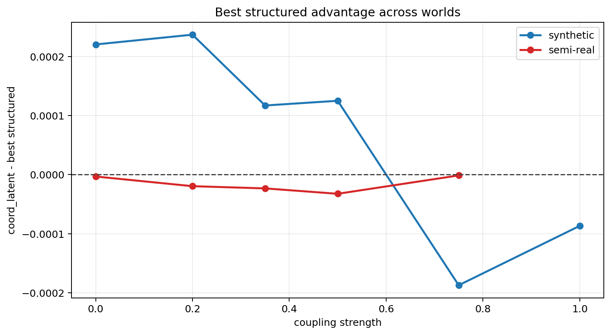
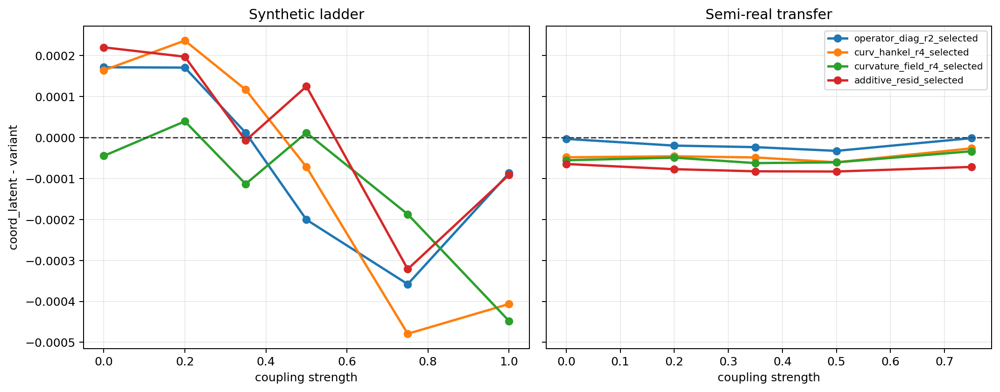
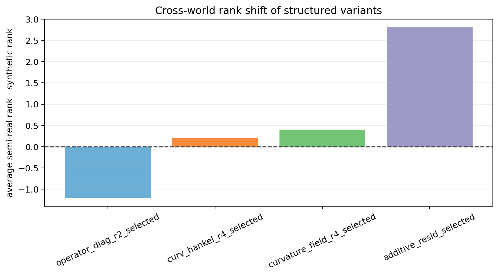

# Cross-World Diagnostic Analysis

This report compares the same structured variants across the strongest synthetic ladder and the semi-real transfer ladder.

## Best Structured Gap

- Synthetic `stepcurve_coupled_4.00_0.00`: best structured `additive_resid_selected` = `0.000452`, `coord_latent` = `0.000672`, gap = `0.000220`.
- Semi-real `semireal_coupled_0.00`: best structured `operator_diag_r2_selected` = `0.000128`, `coord_latent` = `0.000125`, gap = `-0.000003`.
- Synthetic `stepcurve_coupled_4.00_0.20`: best structured `curv_hankel_r4_selected` = `0.000694`, `coord_latent` = `0.000930`, gap = `0.000237`.
- Semi-real `semireal_coupled_0.20`: best structured `operator_diag_r2_selected` = `0.000140`, `coord_latent` = `0.000120`, gap = `-0.000020`.
- Synthetic `stepcurve_coupled_4.00_0.35`: best structured `curv_hankel_r4_selected` = `0.000863`, `coord_latent` = `0.000980`, gap = `0.000117`.
- Semi-real `semireal_coupled_0.35`: best structured `operator_diag_r2_selected` = `0.000141`, `coord_latent` = `0.000118`, gap = `-0.000023`.
- Synthetic `stepcurve_coupled_4.00_0.50`: best structured `additive_resid_selected` = `0.001051`, `coord_latent` = `0.001176`, gap = `0.000125`.
- Semi-real `semireal_coupled_0.50`: best structured `operator_diag_r2_selected` = `0.000156`, `coord_latent` = `0.000124`, gap = `-0.000032`.
- Synthetic `stepcurve_coupled_4.00_0.75`: best structured `curvature_field_r4_selected` = `0.001315`, `coord_latent` = `0.001127`, gap = `-0.000187`.
- Semi-real `semireal_coupled_0.75`: best structured `operator_diag_r2_selected` = `0.000155`, `coord_latent` = `0.000154`, gap = `-0.000001`.

## Average Rank Shift

- `operator_diag_r2_selected`: average rank shift `-1.20` (positive means worse on semi-real).
- `curv_hankel_r4_selected`: average rank shift `+0.20` (positive means worse on semi-real).
- `curvature_field_r4_selected`: average rank shift `+0.40` (positive means worse on semi-real).
- `additive_resid_selected`: average rank shift `+2.80` (positive means worse on semi-real).

## Plots

