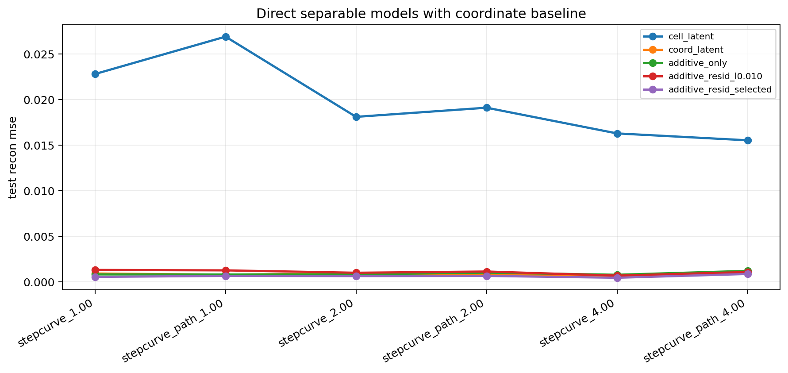
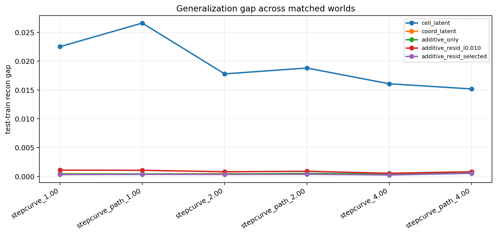
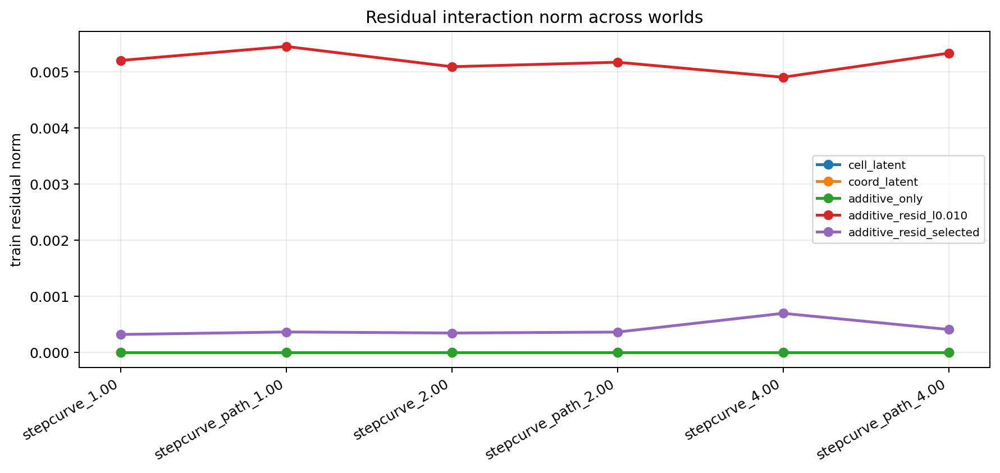

# Direct Separable Probe v2

Split strategy: `cartesian_blocks`
Selection mode: `nested`

## Observations

- `stepcurve_1.00`: family `separable`, step_drift `0.000000`, commutator `0.000000`, cell_latent `0.022825`, coord_latent `0.000918`, additive_only `0.000820`, additive_resid_l0.010 `0.001310`, additive_resid_selected `0.000546` (additive_resid_candidate_l0.050 x3).
- `stepcurve_path_1.00`: family `path`, step_drift `0.000000`, commutator `0.000564`, cell_latent `0.026928`, coord_latent `0.000787`, additive_only `0.000804`, additive_resid_l0.010 `0.001262`, additive_resid_selected `0.000656` (additive_resid_candidate_l0.050 x3).
- `stepcurve_2.00`: family `separable`, step_drift `0.005109`, commutator `0.000000`, cell_latent `0.018120`, coord_latent `0.000925`, additive_only `0.000828`, additive_resid_l0.010 `0.001000`, additive_resid_selected `0.000637` (additive_resid_candidate_l0.050 x3).
- `stepcurve_path_2.00`: family `path`, step_drift `0.005109`, commutator `0.000558`, cell_latent `0.019124`, coord_latent `0.000805`, additive_only `0.001015`, additive_resid_l0.010 `0.001136`, additive_resid_selected `0.000654` (additive_resid_candidate_l0.050 x3).
- `stepcurve_4.00`: family `separable`, step_drift `0.018160`, commutator `0.000000`, cell_latent `0.016300`, coord_latent `0.000672`, additive_only `0.000779`, additive_resid_l0.010 `0.000683`, additive_resid_selected `0.000452` (additive_resid_candidate_l0.020 x1, additive_resid_candidate_l0.050 x2).
- `stepcurve_path_4.00`: family `path`, step_drift `0.018160`, commutator `0.000555`, cell_latent `0.015546`, coord_latent `0.000977`, additive_only `0.001209`, additive_resid_l0.010 `0.001080`, additive_resid_selected `0.000865` (additive_resid_candidate_l0.050 x3).

## Plots

