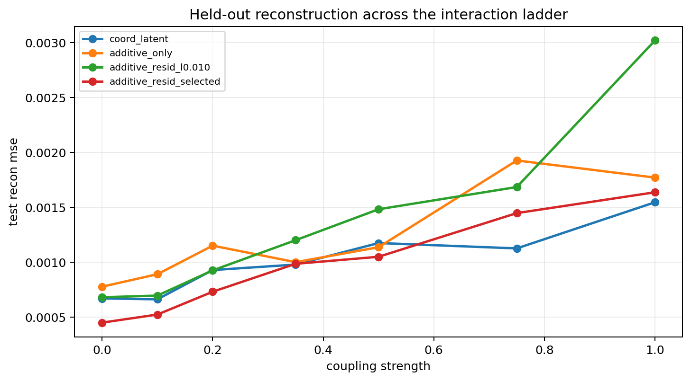
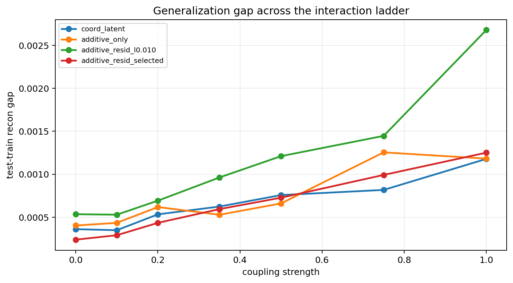
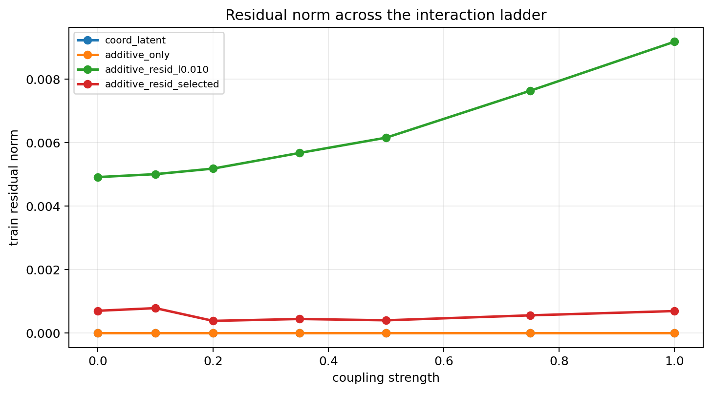
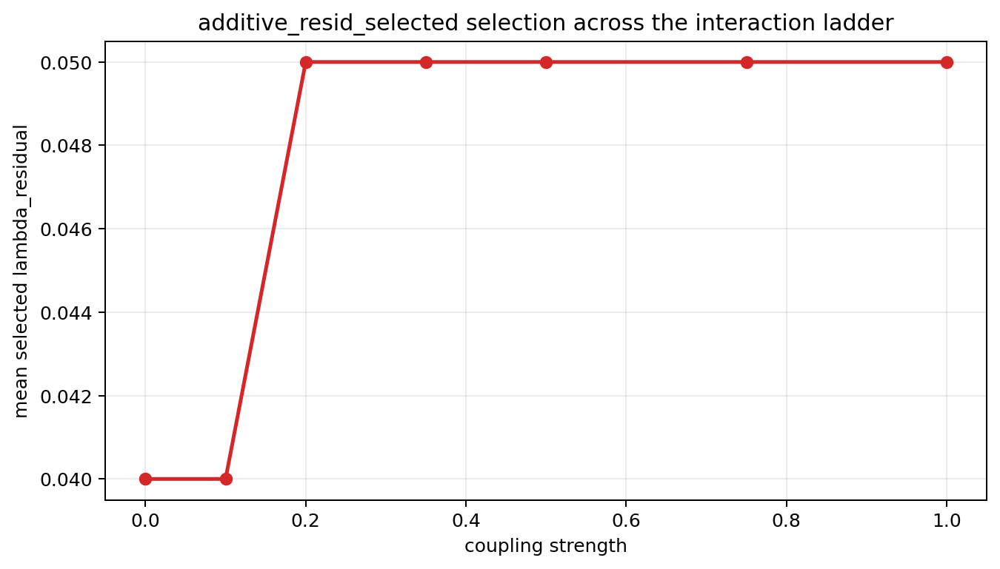

# Interaction Ladder Probe

Gamma: `4.00`
Split strategy: `cartesian_blocks`
Selection mode: `nested`

## Observations

- `stepcurve_coupled_4.00_0.00`: coupling `0.000000`, commutator `0.000000`, coord_latent `0.000672`, additive_only `0.000779`, additive_resid_l0.010 `0.000683`, additive_resid_selected `0.000452` (mean_lambda `0.040000`, additive_resid_candidate_l0.020 x1, additive_resid_candidate_l0.050 x2).
- `stepcurve_coupled_4.00_0.10`: coupling `0.100000`, commutator `0.000116`, coord_latent `0.000664`, additive_only `0.000893`, additive_resid_l0.010 `0.000698`, additive_resid_selected `0.000526` (mean_lambda `0.040000`, additive_resid_candidate_l0.020 x1, additive_resid_candidate_l0.050 x2).
- `stepcurve_coupled_4.00_0.20`: coupling `0.200000`, commutator `0.000460`, coord_latent `0.000930`, additive_only `0.001152`, additive_resid_l0.010 `0.000927`, additive_resid_selected `0.000733` (mean_lambda `0.050000`, additive_resid_candidate_l0.050 x3).
- `stepcurve_coupled_4.00_0.35`: coupling `0.350000`, commutator `0.001374`, coord_latent `0.000980`, additive_only `0.001002`, additive_resid_l0.010 `0.001202`, additive_resid_selected `0.000987` (mean_lambda `0.050000`, additive_resid_candidate_l0.050 x3).
- `stepcurve_coupled_4.00_0.50`: coupling `0.500000`, commutator `0.002757`, coord_latent `0.001176`, additive_only `0.001138`, additive_resid_l0.010 `0.001484`, additive_resid_selected `0.001051` (mean_lambda `0.050000`, additive_resid_candidate_l0.050 x3).
- `stepcurve_coupled_4.00_0.75`: coupling `0.750000`, commutator `0.006072`, coord_latent `0.001127`, additive_only `0.001928`, additive_resid_l0.010 `0.001686`, additive_resid_selected `0.001449` (mean_lambda `0.050000`, additive_resid_candidate_l0.050 x3).
- `stepcurve_coupled_4.00_1.00`: coupling `1.000000`, commutator `0.010371`, coord_latent `0.001547`, additive_only `0.001772`, additive_resid_l0.010 `0.003020`, additive_resid_selected `0.001638` (mean_lambda `0.050000`, additive_resid_candidate_l0.050 x3).

## Plots

