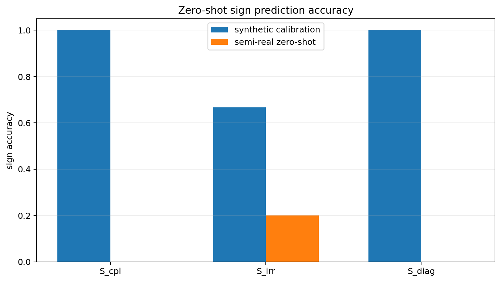
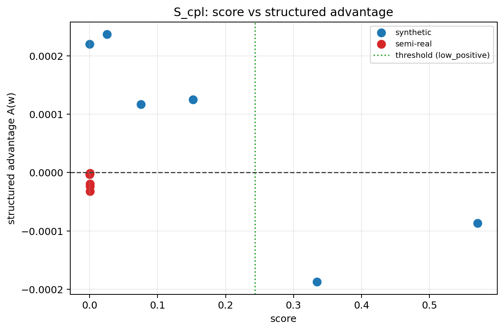
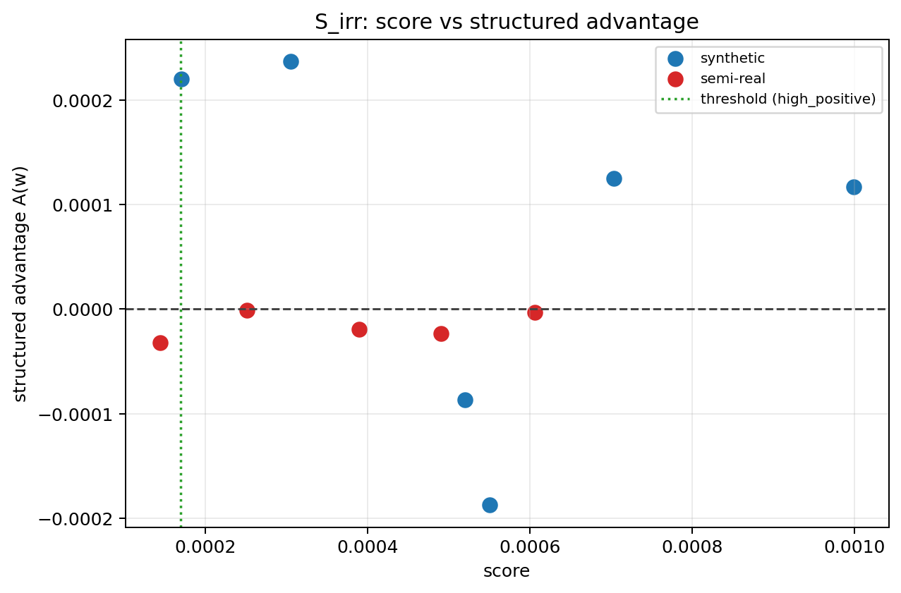
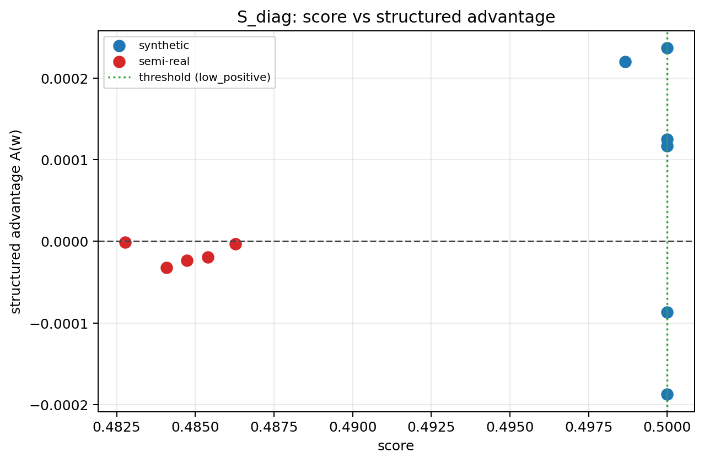

# Interaction Score Validation

Structured advantage is defined as:

`A(w) = MSE_coord(w) - min_s MSE_structured_s(w)`

Positive `A(w)` means the best structured model beats `coord_latent`.

## Summary

- `S_cpl`: synthetic Spearman `-0.829`, semi-real Spearman `+0.000`, synthetic sign accuracy `1.00`, semi-real zero-shot sign accuracy `0.00`, threshold `0.243086`, direction `low_positive`.
- `S_irr`: synthetic Spearman `-0.486`, semi-real Spearman `+0.300`, synthetic sign accuracy `0.67`, semi-real zero-shot sign accuracy `0.20`, threshold `0.000170`, direction `high_positive`.
- `S_diag`: synthetic Spearman `-0.829`, semi-real Spearman `+0.000`, synthetic sign accuracy `1.00`, semi-real zero-shot sign accuracy `0.00`, threshold `0.500000`, direction `low_positive`.

## Plots

