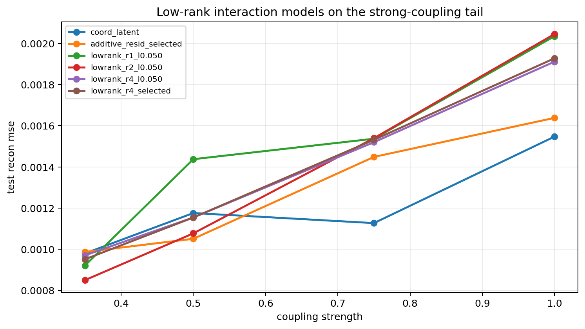
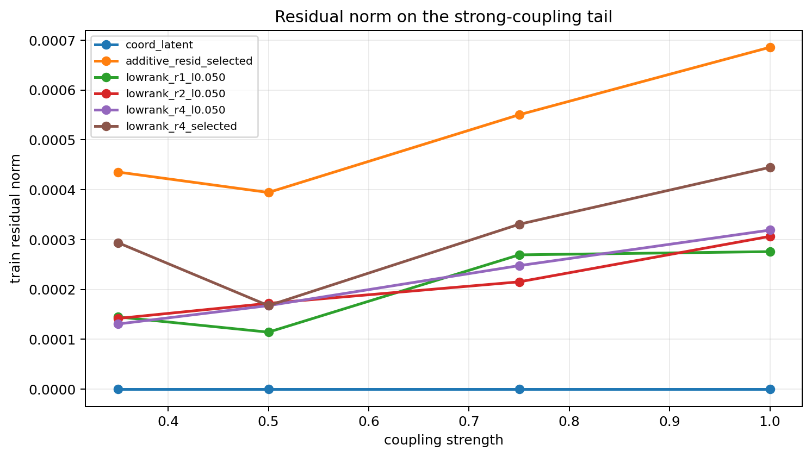

# Low-Rank Tail Probe

Gamma: `4.00`
Split strategy: `cartesian_blocks`

## Observations

- `stepcurve_coupled_4.00_0.35`: coupling `0.350000`, coord_latent `0.000980`, additive_resid_selected `0.000987`, lowrank_r1_l0.050 `0.000922`, lowrank_r2_l0.050 `0.000850`, lowrank_r4_l0.050 `0.000971`, lowrank_r4_selected `0.000952` (mean_lambda `0.030000`, lowrank_r4_candidate_l0.020 x2, lowrank_r4_candidate_l0.050 x1), additive_mean_lambda `0.050000`.
- `stepcurve_coupled_4.00_0.50`: coupling `0.500000`, coord_latent `0.001176`, additive_resid_selected `0.001051`, lowrank_r1_l0.050 `0.001438`, lowrank_r2_l0.050 `0.001078`, lowrank_r4_l0.050 `0.001155`, lowrank_r4_selected `0.001155` (mean_lambda `0.050000`, lowrank_r4_candidate_l0.050 x3), additive_mean_lambda `0.050000`.
- `stepcurve_coupled_4.00_0.75`: coupling `0.750000`, coord_latent `0.001127`, additive_resid_selected `0.001449`, lowrank_r1_l0.050 `0.001537`, lowrank_r2_l0.050 `0.001540`, lowrank_r4_l0.050 `0.001520`, lowrank_r4_selected `0.001532` (mean_lambda `0.040000`, lowrank_r4_candidate_l0.020 x1, lowrank_r4_candidate_l0.050 x2), additive_mean_lambda `0.050000`.
- `stepcurve_coupled_4.00_1.00`: coupling `1.000000`, coord_latent `0.001547`, additive_resid_selected `0.001638`, lowrank_r1_l0.050 `0.002035`, lowrank_r2_l0.050 `0.002045`, lowrank_r4_l0.050 `0.001911`, lowrank_r4_selected `0.001928` (mean_lambda `0.036667`, lowrank_r4_candidate_l0.010 x1, lowrank_r4_candidate_l0.050 x2), additive_mean_lambda `0.050000`.

## Plots

