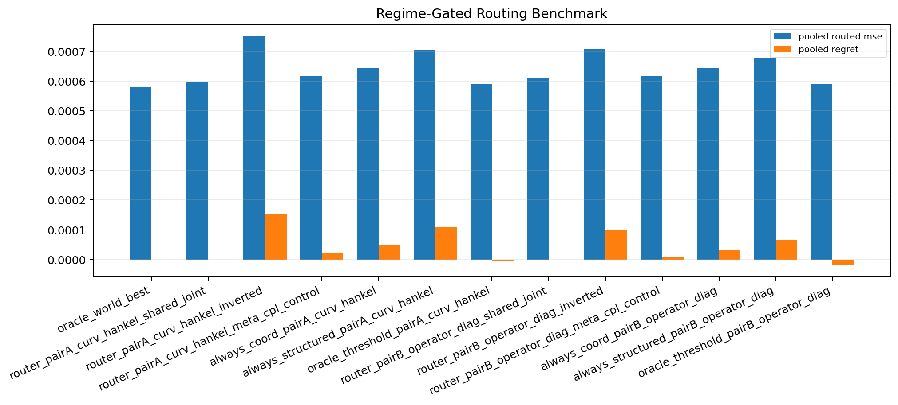
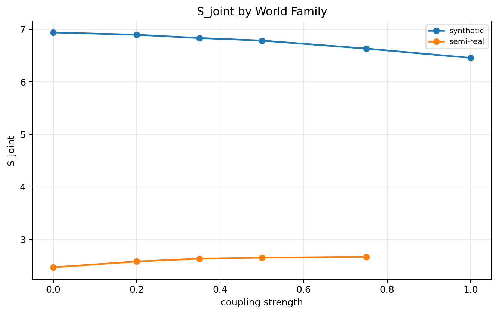

# Regime-Gated Routing v1

Best deployable router:
- `router_pairA_curv_hankel_shared_joint` with pooled routed mse `0.000596`, pooled gain over coord `+0.000047`, pooled regret `0.000000`, semi-real route rate `0.00`.

This benchmark uses synthetic-only threshold calibration and then freezes the router before semi-real evaluation.

Plots:

## router_pairA_curv_hankel_shared_joint

| world | coupling | score | |S-tau| | delta_pair | route | coord mse | structured variant | structured mse | routed mse | oracle variant | oracle mse | regret |
| --- | ---: | ---: | ---: | ---: | --- | ---: | --- | ---: | ---: | --- | ---: | ---: |
| stepcurve_coupled_4.00_0.00 | 0.00 | 6.939722 | 0.129831 | +0.000164 | curv_hankel_r4_selected | 0.000672 | curv_hankel_r4_selected | 0.000508 | 0.000508 | curv_hankel_r4_selected | 0.000508 | 0.000000 |
| stepcurve_coupled_4.00_0.20 | 0.20 | 6.895865 | 0.085975 | +0.000237 | curv_hankel_r4_selected | 0.000930 | curv_hankel_r4_selected | 0.000694 | 0.000694 | curv_hankel_r4_selected | 0.000694 | 0.000000 |
| stepcurve_coupled_4.00_0.35 | 0.35 | 6.833909 | 0.024019 | +0.000117 | curv_hankel_r4_selected | 0.000980 | curv_hankel_r4_selected | 0.000863 | 0.000863 | curv_hankel_r4_selected | 0.000863 | 0.000000 |
| stepcurve_coupled_4.00_0.50 | 0.50 | 6.785872 | 0.024019 | -0.000072 | coord_latent | 0.001176 | curv_hankel_r4_selected | 0.001248 | 0.001176 | coord_latent | 0.001176 | 0.000000 |
| stepcurve_coupled_4.00_0.75 | 0.75 | 6.633877 | 0.176014 | -0.000479 | coord_latent | 0.001127 | curv_hankel_r4_selected | 0.001606 | 0.001127 | coord_latent | 0.001127 | 0.000000 |
| stepcurve_coupled_4.00_1.00 | 1.00 | 6.456470 | 0.353420 | -0.000406 | coord_latent | 0.001547 | curv_hankel_r4_selected | 0.001954 | 0.001547 | coord_latent | 0.001547 | 0.000000 |
| semireal_coupled_0.00 | 0.00 | 2.467845 | 4.342045 | -0.000048 | coord_latent | 0.000125 | curv_hankel_r4_selected | 0.000173 | 0.000125 | coord_latent | 0.000125 | 0.000000 |
| semireal_coupled_0.20 | 0.20 | 2.579223 | 4.230667 | -0.000046 | coord_latent | 0.000120 | curv_hankel_r4_selected | 0.000166 | 0.000120 | coord_latent | 0.000120 | 0.000000 |
| semireal_coupled_0.35 | 0.35 | 2.633521 | 4.176370 | -0.000049 | coord_latent | 0.000118 | curv_hankel_r4_selected | 0.000167 | 0.000118 | coord_latent | 0.000118 | 0.000000 |
| semireal_coupled_0.50 | 0.50 | 2.652978 | 4.156913 | -0.000060 | coord_latent | 0.000124 | curv_hankel_r4_selected | 0.000184 | 0.000124 | coord_latent | 0.000124 | 0.000000 |
| semireal_coupled_0.75 | 0.75 | 2.670023 | 4.139867 | -0.000026 | coord_latent | 0.000154 | curv_hankel_r4_selected | 0.000180 | 0.000154 | coord_latent | 0.000154 | 0.000000 |

## router_pairA_curv_hankel_inverted

| world | coupling | score | |S-tau| | delta_pair | route | coord mse | structured variant | structured mse | routed mse | oracle variant | oracle mse | regret |
| --- | ---: | ---: | ---: | ---: | --- | ---: | --- | ---: | ---: | --- | ---: | ---: |
| stepcurve_coupled_4.00_0.00 | 0.00 | 6.939722 | 0.129831 | +0.000164 | coord_latent | 0.000672 | curv_hankel_r4_selected | 0.000508 | 0.000672 | curv_hankel_r4_selected | 0.000508 | 0.000164 |
| stepcurve_coupled_4.00_0.20 | 0.20 | 6.895865 | 0.085975 | +0.000237 | coord_latent | 0.000930 | curv_hankel_r4_selected | 0.000694 | 0.000930 | curv_hankel_r4_selected | 0.000694 | 0.000237 |
| stepcurve_coupled_4.00_0.35 | 0.35 | 6.833909 | 0.024019 | +0.000117 | coord_latent | 0.000980 | curv_hankel_r4_selected | 0.000863 | 0.000980 | curv_hankel_r4_selected | 0.000863 | 0.000117 |
| stepcurve_coupled_4.00_0.50 | 0.50 | 6.785872 | 0.024019 | -0.000072 | curv_hankel_r4_selected | 0.001176 | curv_hankel_r4_selected | 0.001248 | 0.001248 | coord_latent | 0.001176 | 0.000072 |
| stepcurve_coupled_4.00_0.75 | 0.75 | 6.633877 | 0.176014 | -0.000479 | curv_hankel_r4_selected | 0.001127 | curv_hankel_r4_selected | 0.001606 | 0.001606 | coord_latent | 0.001127 | 0.000479 |
| stepcurve_coupled_4.00_1.00 | 1.00 | 6.456470 | 0.353420 | -0.000406 | curv_hankel_r4_selected | 0.001547 | curv_hankel_r4_selected | 0.001954 | 0.001954 | coord_latent | 0.001547 | 0.000406 |
| semireal_coupled_0.00 | 0.00 | 2.467845 | 4.342045 | -0.000048 | curv_hankel_r4_selected | 0.000125 | curv_hankel_r4_selected | 0.000173 | 0.000173 | coord_latent | 0.000125 | 0.000048 |
| semireal_coupled_0.20 | 0.20 | 2.579223 | 4.230667 | -0.000046 | curv_hankel_r4_selected | 0.000120 | curv_hankel_r4_selected | 0.000166 | 0.000166 | coord_latent | 0.000120 | 0.000046 |
| semireal_coupled_0.35 | 0.35 | 2.633521 | 4.176370 | -0.000049 | curv_hankel_r4_selected | 0.000118 | curv_hankel_r4_selected | 0.000167 | 0.000167 | coord_latent | 0.000118 | 0.000049 |
| semireal_coupled_0.50 | 0.50 | 2.652978 | 4.156913 | -0.000060 | curv_hankel_r4_selected | 0.000124 | curv_hankel_r4_selected | 0.000184 | 0.000184 | coord_latent | 0.000124 | 0.000060 |
| semireal_coupled_0.75 | 0.75 | 2.670023 | 4.139867 | -0.000026 | curv_hankel_r4_selected | 0.000154 | curv_hankel_r4_selected | 0.000180 | 0.000180 | coord_latent | 0.000154 | 0.000026 |

## router_pairA_curv_hankel_meta_cpl_control

| world | coupling | score | |S-tau| | delta_pair | route | coord mse | structured variant | structured mse | routed mse | oracle variant | oracle mse | regret |
| --- | ---: | ---: | ---: | ---: | --- | ---: | --- | ---: | ---: | --- | ---: | ---: |
| stepcurve_coupled_4.00_0.00 | 0.00 | 0.000000 | 0.113760 | +0.000164 | curv_hankel_r4_selected | 0.000672 | curv_hankel_r4_selected | 0.000508 | 0.000508 | curv_hankel_r4_selected | 0.000508 | 0.000000 |
| stepcurve_coupled_4.00_0.20 | 0.20 | 0.025342 | 0.088418 | +0.000237 | curv_hankel_r4_selected | 0.000930 | curv_hankel_r4_selected | 0.000694 | 0.000694 | curv_hankel_r4_selected | 0.000694 | 0.000000 |
| stepcurve_coupled_4.00_0.35 | 0.35 | 0.075685 | 0.038075 | +0.000117 | curv_hankel_r4_selected | 0.000980 | curv_hankel_r4_selected | 0.000863 | 0.000863 | curv_hankel_r4_selected | 0.000863 | 0.000000 |
| stepcurve_coupled_4.00_0.50 | 0.50 | 0.151835 | 0.038075 | -0.000072 | coord_latent | 0.001176 | curv_hankel_r4_selected | 0.001248 | 0.001176 | coord_latent | 0.001176 | 0.000000 |
| stepcurve_coupled_4.00_0.75 | 0.75 | 0.334338 | 0.220578 | -0.000479 | coord_latent | 0.001127 | curv_hankel_r4_selected | 0.001606 | 0.001127 | coord_latent | 0.001127 | 0.000000 |
| stepcurve_coupled_4.00_1.00 | 1.00 | 0.571065 | 0.457306 | -0.000406 | coord_latent | 0.001547 | curv_hankel_r4_selected | 0.001954 | 0.001547 | coord_latent | 0.001547 | 0.000000 |
| semireal_coupled_0.00 | 0.00 | 0.000000 | 0.113760 | -0.000048 | curv_hankel_r4_selected | 0.000125 | curv_hankel_r4_selected | 0.000173 | 0.000173 | coord_latent | 0.000125 | 0.000048 |
| semireal_coupled_0.20 | 0.20 | 0.000659 | 0.113101 | -0.000046 | curv_hankel_r4_selected | 0.000120 | curv_hankel_r4_selected | 0.000166 | 0.000166 | coord_latent | 0.000120 | 0.000046 |
| semireal_coupled_0.35 | 0.35 | 0.000669 | 0.113091 | -0.000049 | curv_hankel_r4_selected | 0.000118 | curv_hankel_r4_selected | 0.000167 | 0.000167 | coord_latent | 0.000118 | 0.000049 |
| semireal_coupled_0.50 | 0.50 | 0.000683 | 0.113077 | -0.000060 | curv_hankel_r4_selected | 0.000124 | curv_hankel_r4_selected | 0.000184 | 0.000184 | coord_latent | 0.000124 | 0.000060 |
| semireal_coupled_0.75 | 0.75 | 0.000718 | 0.113042 | -0.000026 | curv_hankel_r4_selected | 0.000154 | curv_hankel_r4_selected | 0.000180 | 0.000180 | coord_latent | 0.000154 | 0.000026 |

## router_pairB_operator_diag_shared_joint

| world | coupling | score | |S-tau| | delta_pair | route | coord mse | structured variant | structured mse | routed mse | oracle variant | oracle mse | regret |
| --- | ---: | ---: | ---: | ---: | --- | ---: | --- | ---: | ---: | --- | ---: | ---: |
| stepcurve_coupled_4.00_0.00 | 0.00 | 6.939722 | 0.129831 | +0.000172 | operator_diag_r2_selected | 0.000672 | operator_diag_r2_selected | 0.000500 | 0.000500 | operator_diag_r2_selected | 0.000500 | 0.000000 |
| stepcurve_coupled_4.00_0.20 | 0.20 | 6.895865 | 0.085975 | +0.000171 | operator_diag_r2_selected | 0.000930 | operator_diag_r2_selected | 0.000760 | 0.000760 | operator_diag_r2_selected | 0.000760 | 0.000000 |
| stepcurve_coupled_4.00_0.35 | 0.35 | 6.833909 | 0.024019 | +0.000012 | operator_diag_r2_selected | 0.000980 | operator_diag_r2_selected | 0.000968 | 0.000968 | operator_diag_r2_selected | 0.000968 | 0.000000 |
| stepcurve_coupled_4.00_0.50 | 0.50 | 6.785872 | 0.024019 | -0.000201 | coord_latent | 0.001176 | operator_diag_r2_selected | 0.001377 | 0.001176 | coord_latent | 0.001176 | 0.000000 |
| stepcurve_coupled_4.00_0.75 | 0.75 | 6.633877 | 0.176014 | -0.000358 | coord_latent | 0.001127 | operator_diag_r2_selected | 0.001485 | 0.001127 | coord_latent | 0.001127 | 0.000000 |
| stepcurve_coupled_4.00_1.00 | 1.00 | 6.456470 | 0.353420 | -0.000087 | coord_latent | 0.001547 | operator_diag_r2_selected | 0.001634 | 0.001547 | coord_latent | 0.001547 | 0.000000 |
| semireal_coupled_0.00 | 0.00 | 2.467845 | 4.342045 | -0.000003 | coord_latent | 0.000125 | operator_diag_r2_selected | 0.000128 | 0.000125 | coord_latent | 0.000125 | 0.000000 |
| semireal_coupled_0.20 | 0.20 | 2.579223 | 4.230667 | -0.000020 | coord_latent | 0.000120 | operator_diag_r2_selected | 0.000140 | 0.000120 | coord_latent | 0.000120 | 0.000000 |
| semireal_coupled_0.35 | 0.35 | 2.633521 | 4.176370 | -0.000023 | coord_latent | 0.000118 | operator_diag_r2_selected | 0.000141 | 0.000118 | coord_latent | 0.000118 | 0.000000 |
| semireal_coupled_0.50 | 0.50 | 2.652978 | 4.156913 | -0.000032 | coord_latent | 0.000124 | operator_diag_r2_selected | 0.000156 | 0.000124 | coord_latent | 0.000124 | 0.000000 |
| semireal_coupled_0.75 | 0.75 | 2.670023 | 4.139867 | -0.000001 | coord_latent | 0.000154 | operator_diag_r2_selected | 0.000155 | 0.000154 | coord_latent | 0.000154 | 0.000000 |

## router_pairB_operator_diag_inverted

| world | coupling | score | |S-tau| | delta_pair | route | coord mse | structured variant | structured mse | routed mse | oracle variant | oracle mse | regret |
| --- | ---: | ---: | ---: | ---: | --- | ---: | --- | ---: | ---: | --- | ---: | ---: |
| stepcurve_coupled_4.00_0.00 | 0.00 | 6.939722 | 0.129831 | +0.000172 | coord_latent | 0.000672 | operator_diag_r2_selected | 0.000500 | 0.000672 | operator_diag_r2_selected | 0.000500 | 0.000172 |
| stepcurve_coupled_4.00_0.20 | 0.20 | 6.895865 | 0.085975 | +0.000171 | coord_latent | 0.000930 | operator_diag_r2_selected | 0.000760 | 0.000930 | operator_diag_r2_selected | 0.000760 | 0.000171 |
| stepcurve_coupled_4.00_0.35 | 0.35 | 6.833909 | 0.024019 | +0.000012 | coord_latent | 0.000980 | operator_diag_r2_selected | 0.000968 | 0.000980 | operator_diag_r2_selected | 0.000968 | 0.000012 |
| stepcurve_coupled_4.00_0.50 | 0.50 | 6.785872 | 0.024019 | -0.000201 | operator_diag_r2_selected | 0.001176 | operator_diag_r2_selected | 0.001377 | 0.001377 | coord_latent | 0.001176 | 0.000201 |
| stepcurve_coupled_4.00_0.75 | 0.75 | 6.633877 | 0.176014 | -0.000358 | operator_diag_r2_selected | 0.001127 | operator_diag_r2_selected | 0.001485 | 0.001485 | coord_latent | 0.001127 | 0.000358 |
| stepcurve_coupled_4.00_1.00 | 1.00 | 6.456470 | 0.353420 | -0.000087 | operator_diag_r2_selected | 0.001547 | operator_diag_r2_selected | 0.001634 | 0.001634 | coord_latent | 0.001547 | 0.000087 |
| semireal_coupled_0.00 | 0.00 | 2.467845 | 4.342045 | -0.000003 | operator_diag_r2_selected | 0.000125 | operator_diag_r2_selected | 0.000128 | 0.000128 | coord_latent | 0.000125 | 0.000003 |
| semireal_coupled_0.20 | 0.20 | 2.579223 | 4.230667 | -0.000020 | operator_diag_r2_selected | 0.000120 | operator_diag_r2_selected | 0.000140 | 0.000140 | coord_latent | 0.000120 | 0.000020 |
| semireal_coupled_0.35 | 0.35 | 2.633521 | 4.176370 | -0.000023 | operator_diag_r2_selected | 0.000118 | operator_diag_r2_selected | 0.000141 | 0.000141 | coord_latent | 0.000118 | 0.000023 |
| semireal_coupled_0.50 | 0.50 | 2.652978 | 4.156913 | -0.000032 | operator_diag_r2_selected | 0.000124 | operator_diag_r2_selected | 0.000156 | 0.000156 | coord_latent | 0.000124 | 0.000032 |
| semireal_coupled_0.75 | 0.75 | 2.670023 | 4.139867 | -0.000001 | operator_diag_r2_selected | 0.000154 | operator_diag_r2_selected | 0.000155 | 0.000155 | coord_latent | 0.000154 | 0.000001 |

## router_pairB_operator_diag_meta_cpl_control

| world | coupling | score | |S-tau| | delta_pair | route | coord mse | structured variant | structured mse | routed mse | oracle variant | oracle mse | regret |
| --- | ---: | ---: | ---: | ---: | --- | ---: | --- | ---: | ---: | --- | ---: | ---: |
| stepcurve_coupled_4.00_0.00 | 0.00 | 0.000000 | 0.113760 | +0.000172 | operator_diag_r2_selected | 0.000672 | operator_diag_r2_selected | 0.000500 | 0.000500 | operator_diag_r2_selected | 0.000500 | 0.000000 |
| stepcurve_coupled_4.00_0.20 | 0.20 | 0.025342 | 0.088418 | +0.000171 | operator_diag_r2_selected | 0.000930 | operator_diag_r2_selected | 0.000760 | 0.000760 | operator_diag_r2_selected | 0.000760 | 0.000000 |
| stepcurve_coupled_4.00_0.35 | 0.35 | 0.075685 | 0.038075 | +0.000012 | operator_diag_r2_selected | 0.000980 | operator_diag_r2_selected | 0.000968 | 0.000968 | operator_diag_r2_selected | 0.000968 | 0.000000 |
| stepcurve_coupled_4.00_0.50 | 0.50 | 0.151835 | 0.038075 | -0.000201 | coord_latent | 0.001176 | operator_diag_r2_selected | 0.001377 | 0.001176 | coord_latent | 0.001176 | 0.000000 |
| stepcurve_coupled_4.00_0.75 | 0.75 | 0.334338 | 0.220578 | -0.000358 | coord_latent | 0.001127 | operator_diag_r2_selected | 0.001485 | 0.001127 | coord_latent | 0.001127 | 0.000000 |
| stepcurve_coupled_4.00_1.00 | 1.00 | 0.571065 | 0.457306 | -0.000087 | coord_latent | 0.001547 | operator_diag_r2_selected | 0.001634 | 0.001547 | coord_latent | 0.001547 | 0.000000 |
| semireal_coupled_0.00 | 0.00 | 0.000000 | 0.113760 | -0.000003 | operator_diag_r2_selected | 0.000125 | operator_diag_r2_selected | 0.000128 | 0.000128 | coord_latent | 0.000125 | 0.000003 |
| semireal_coupled_0.20 | 0.20 | 0.000659 | 0.113101 | -0.000020 | operator_diag_r2_selected | 0.000120 | operator_diag_r2_selected | 0.000140 | 0.000140 | coord_latent | 0.000120 | 0.000020 |
| semireal_coupled_0.35 | 0.35 | 0.000669 | 0.113091 | -0.000023 | operator_diag_r2_selected | 0.000118 | operator_diag_r2_selected | 0.000141 | 0.000141 | coord_latent | 0.000118 | 0.000023 |
| semireal_coupled_0.50 | 0.50 | 0.000683 | 0.113077 | -0.000032 | operator_diag_r2_selected | 0.000124 | operator_diag_r2_selected | 0.000156 | 0.000156 | coord_latent | 0.000124 | 0.000032 |
| semireal_coupled_0.75 | 0.75 | 0.000718 | 0.113042 | -0.000001 | operator_diag_r2_selected | 0.000154 | operator_diag_r2_selected | 0.000155 | 0.000155 | coord_latent | 0.000154 | 0.000001 |
