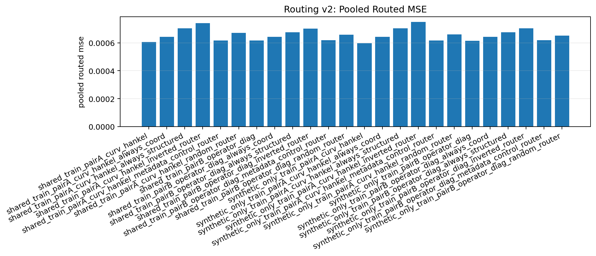
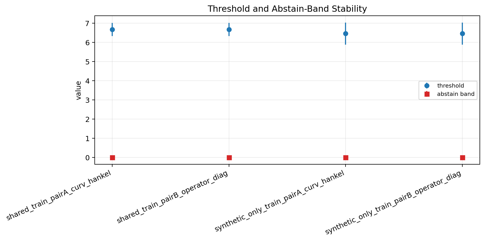

# Regime-Gated Routing v2

Best deployable router:
- `synthetic_only_train_pairA_curv_hankel` with pooled routed mse `0.000597`, pooled gain over coord `+0.000046`, semi-real gain over coord `+0.000000`, semi-real route rate `0.00`.

Plots:

## shared_train_pairA_curv_hankel

- encoder mode: `shared_train`
- pair: `pairA_curv_hankel`
- threshold: `6.667690+/-0.348642`
- abstain band: `0.000000+/-0.000000`

| world | family | score_mean | score_std | |score-tau| | delta_pair | route | coord_mse | structured_mse | routed_mse | oracle_mse | regret |
| --- | --- | ---: | ---: | ---: | ---: | --- | ---: | ---: | ---: | ---: | ---: |
| semireal_coupled_0.00 | semi-real | 2.034386 | 0.652998 | 4.633304 | -0.000048 | mixed structured 2/5 | 0.000125 | 0.000173 | 0.000144 | 0.000125 | 0.000019 |
| semireal_coupled_0.20 | semi-real | 2.179106 | 0.645679 | 4.488585 | -0.000046 | mixed structured 2/5 | 0.000120 | 0.000166 | 0.000138 | 0.000120 | 0.000018 |
| semireal_coupled_0.35 | semi-real | 2.258372 | 0.611029 | 4.409318 | -0.000049 | mixed structured 2/5 | 0.000118 | 0.000167 | 0.000137 | 0.000118 | 0.000019 |
| semireal_coupled_0.50 | semi-real | 2.305796 | 0.560023 | 4.361894 | -0.000060 | mixed structured 2/5 | 0.000124 | 0.000184 | 0.000148 | 0.000124 | 0.000024 |
| semireal_coupled_0.75 | semi-real | 2.344242 | 0.480761 | 4.323448 | -0.000026 | mixed structured 2/5 | 0.000154 | 0.000180 | 0.000165 | 0.000154 | 0.000011 |
| stepcurve_coupled_4.00_0.00 | synthetic | 6.803294 | 0.161747 | 0.246387 | +0.000164 | structured 5/5 | 0.000672 | 0.000508 | 0.000508 | 0.000508 | 0.000000 |
| stepcurve_coupled_4.00_0.20 | synthetic | 6.758190 | 0.220268 | 0.118253 | +0.000237 | structured 5/5 | 0.000930 | 0.000694 | 0.000694 | 0.000694 | 0.000000 |
| stepcurve_coupled_4.00_0.35 | synthetic | 6.646607 | 0.290710 | 0.061525 | +0.000117 | structured 5/5 | 0.000980 | 0.000863 | 0.000863 | 0.000863 | 0.000000 |
| stepcurve_coupled_4.00_0.50 | synthetic | 6.627410 | 0.362809 | 0.047860 | -0.000072 | mixed structured 1/5 | 0.001176 | 0.001248 | 0.001190 | 0.001176 | 0.000014 |
| stepcurve_coupled_4.00_0.75 | synthetic | 6.657318 | 0.577919 | 0.233027 | -0.000479 | coord 5/5 | 0.001127 | 0.001606 | 0.001127 | 0.001127 | 0.000000 |
| stepcurve_coupled_4.00_1.00 | synthetic | 6.782334 | 0.804481 | 0.426780 | -0.000406 | coord 5/5 | 0.001547 | 0.001954 | 0.001547 | 0.001547 | 0.000000 |

## shared_train_pairB_operator_diag

- encoder mode: `shared_train`
- pair: `pairB_operator_diag`
- threshold: `6.667690+/-0.348642`
- abstain band: `0.000000+/-0.000000`

| world | family | score_mean | score_std | |score-tau| | delta_pair | route | coord_mse | structured_mse | routed_mse | oracle_mse | regret |
| --- | --- | ---: | ---: | ---: | ---: | --- | ---: | ---: | ---: | ---: | ---: |
| semireal_coupled_0.00 | semi-real | 2.034386 | 0.652998 | 4.633304 | -0.000003 | mixed structured 2/5 | 0.000125 | 0.000128 | 0.000126 | 0.000125 | 0.000001 |
| semireal_coupled_0.20 | semi-real | 2.179106 | 0.645679 | 4.488585 | -0.000020 | mixed structured 2/5 | 0.000120 | 0.000140 | 0.000128 | 0.000120 | 0.000008 |
| semireal_coupled_0.35 | semi-real | 2.258372 | 0.611029 | 4.409318 | -0.000023 | mixed structured 2/5 | 0.000118 | 0.000141 | 0.000127 | 0.000118 | 0.000009 |
| semireal_coupled_0.50 | semi-real | 2.305796 | 0.560023 | 4.361894 | -0.000032 | mixed structured 2/5 | 0.000124 | 0.000156 | 0.000137 | 0.000124 | 0.000013 |
| semireal_coupled_0.75 | semi-real | 2.344242 | 0.480761 | 4.323448 | -0.000001 | mixed structured 2/5 | 0.000154 | 0.000155 | 0.000155 | 0.000154 | 0.000001 |
| stepcurve_coupled_4.00_0.00 | synthetic | 6.803294 | 0.161747 | 0.246387 | +0.000172 | structured 5/5 | 0.000672 | 0.000500 | 0.000500 | 0.000500 | 0.000000 |
| stepcurve_coupled_4.00_0.20 | synthetic | 6.758190 | 0.220268 | 0.118253 | +0.000171 | structured 5/5 | 0.000930 | 0.000760 | 0.000760 | 0.000760 | 0.000000 |
| stepcurve_coupled_4.00_0.35 | synthetic | 6.646607 | 0.290710 | 0.061525 | +0.000012 | structured 5/5 | 0.000980 | 0.000968 | 0.000968 | 0.000968 | 0.000000 |
| stepcurve_coupled_4.00_0.50 | synthetic | 6.627410 | 0.362809 | 0.047860 | -0.000201 | mixed structured 1/5 | 0.001176 | 0.001377 | 0.001216 | 0.001176 | 0.000040 |
| stepcurve_coupled_4.00_0.75 | synthetic | 6.657318 | 0.577919 | 0.233027 | -0.000358 | coord 5/5 | 0.001127 | 0.001485 | 0.001127 | 0.001127 | 0.000000 |
| stepcurve_coupled_4.00_1.00 | synthetic | 6.782334 | 0.804481 | 0.426780 | -0.000087 | coord 5/5 | 0.001547 | 0.001634 | 0.001547 | 0.001547 | 0.000000 |

## synthetic_only_train_pairA_curv_hankel

- encoder mode: `synthetic_only_train`
- pair: `pairA_curv_hankel`
- threshold: `6.454461+/-0.573399`
- abstain band: `0.000000+/-0.000000`

| world | family | score_mean | score_std | |score-tau| | delta_pair | route | coord_mse | structured_mse | routed_mse | oracle_mse | regret |
| --- | --- | ---: | ---: | ---: | ---: | --- | ---: | ---: | ---: | ---: | ---: |
| semireal_coupled_0.00 | semi-real | 0.458248 | 0.166531 | 5.996213 | -0.000048 | coord 5/5 | 0.000125 | 0.000173 | 0.000125 | 0.000125 | 0.000000 |
| semireal_coupled_0.20 | semi-real | 0.472435 | 0.154922 | 5.982027 | -0.000046 | coord 5/5 | 0.000120 | 0.000166 | 0.000120 | 0.000120 | 0.000000 |
| semireal_coupled_0.35 | semi-real | 0.510658 | 0.141840 | 5.943803 | -0.000049 | coord 5/5 | 0.000118 | 0.000167 | 0.000118 | 0.000118 | 0.000000 |
| semireal_coupled_0.50 | semi-real | 0.566021 | 0.131262 | 5.888440 | -0.000060 | coord 5/5 | 0.000124 | 0.000184 | 0.000124 | 0.000124 | 0.000000 |
| semireal_coupled_0.75 | semi-real | 0.657637 | 0.122396 | 5.796824 | -0.000026 | coord 5/5 | 0.000154 | 0.000180 | 0.000154 | 0.000154 | 0.000000 |
| stepcurve_coupled_4.00_0.00 | synthetic | 6.749940 | 0.418733 | 0.295478 | +0.000164 | structured 5/5 | 0.000672 | 0.000508 | 0.000508 | 0.000508 | 0.000000 |
| stepcurve_coupled_4.00_0.20 | synthetic | 6.754772 | 0.479753 | 0.300311 | +0.000237 | structured 5/5 | 0.000930 | 0.000694 | 0.000694 | 0.000694 | 0.000000 |
| stepcurve_coupled_4.00_0.35 | synthetic | 6.589499 | 0.585054 | 0.135038 | +0.000117 | structured 5/5 | 0.000980 | 0.000863 | 0.000863 | 0.000863 | 0.000000 |
| stepcurve_coupled_4.00_0.50 | synthetic | 6.399390 | 0.694151 | 0.132900 | -0.000072 | mixed structured 1/5 | 0.001176 | 0.001248 | 0.001190 | 0.001176 | 0.000014 |
| stepcurve_coupled_4.00_0.75 | synthetic | 6.222219 | 0.685807 | 0.232242 | -0.000479 | coord 5/5 | 0.001127 | 0.001606 | 0.001127 | 0.001127 | 0.000000 |
| stepcurve_coupled_4.00_1.00 | synthetic | 6.180458 | 0.514904 | 0.274003 | -0.000406 | coord 5/5 | 0.001547 | 0.001954 | 0.001547 | 0.001547 | 0.000000 |

## synthetic_only_train_pairB_operator_diag

- encoder mode: `synthetic_only_train`
- pair: `pairB_operator_diag`
- threshold: `6.454461+/-0.573399`
- abstain band: `0.000000+/-0.000000`

| world | family | score_mean | score_std | |score-tau| | delta_pair | route | coord_mse | structured_mse | routed_mse | oracle_mse | regret |
| --- | --- | ---: | ---: | ---: | ---: | --- | ---: | ---: | ---: | ---: | ---: |
| semireal_coupled_0.00 | semi-real | 0.458248 | 0.166531 | 5.996213 | -0.000003 | coord 5/5 | 0.000125 | 0.000128 | 0.000125 | 0.000125 | 0.000000 |
| semireal_coupled_0.20 | semi-real | 0.472435 | 0.154922 | 5.982027 | -0.000020 | coord 5/5 | 0.000120 | 0.000140 | 0.000120 | 0.000120 | 0.000000 |
| semireal_coupled_0.35 | semi-real | 0.510658 | 0.141840 | 5.943803 | -0.000023 | coord 5/5 | 0.000118 | 0.000141 | 0.000118 | 0.000118 | 0.000000 |
| semireal_coupled_0.50 | semi-real | 0.566021 | 0.131262 | 5.888440 | -0.000032 | coord 5/5 | 0.000124 | 0.000156 | 0.000124 | 0.000124 | 0.000000 |
| semireal_coupled_0.75 | semi-real | 0.657637 | 0.122396 | 5.796824 | -0.000001 | coord 5/5 | 0.000154 | 0.000155 | 0.000154 | 0.000154 | 0.000000 |
| stepcurve_coupled_4.00_0.00 | synthetic | 6.749940 | 0.418733 | 0.295478 | +0.000172 | structured 5/5 | 0.000672 | 0.000500 | 0.000500 | 0.000500 | 0.000000 |
| stepcurve_coupled_4.00_0.20 | synthetic | 6.754772 | 0.479753 | 0.300311 | +0.000171 | structured 5/5 | 0.000930 | 0.000760 | 0.000760 | 0.000760 | 0.000000 |
| stepcurve_coupled_4.00_0.35 | synthetic | 6.589499 | 0.585054 | 0.135038 | +0.000012 | structured 5/5 | 0.000980 | 0.000968 | 0.000968 | 0.000968 | 0.000000 |
| stepcurve_coupled_4.00_0.50 | synthetic | 6.399390 | 0.694151 | 0.132900 | -0.000201 | mixed structured 1/5 | 0.001176 | 0.001377 | 0.001216 | 0.001176 | 0.000040 |
| stepcurve_coupled_4.00_0.75 | synthetic | 6.222219 | 0.685807 | 0.232242 | -0.000358 | coord 5/5 | 0.001127 | 0.001485 | 0.001127 | 0.001127 | 0.000000 |
| stepcurve_coupled_4.00_1.00 | synthetic | 6.180458 | 0.514904 | 0.274003 | -0.000087 | coord 5/5 | 0.001547 | 0.001634 | 0.001547 | 0.001547 | 0.000000 |
