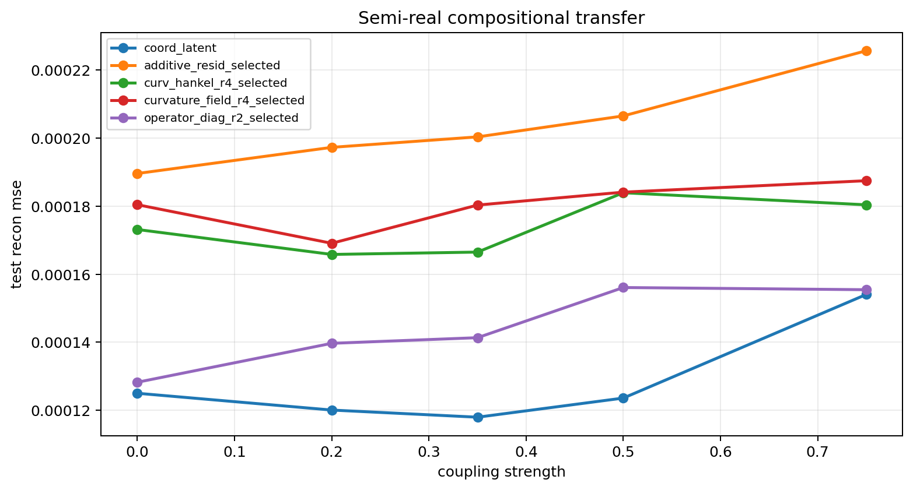
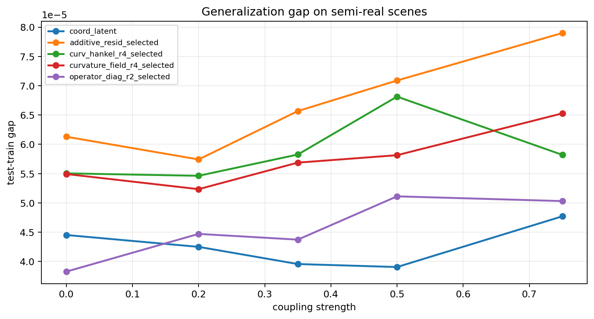
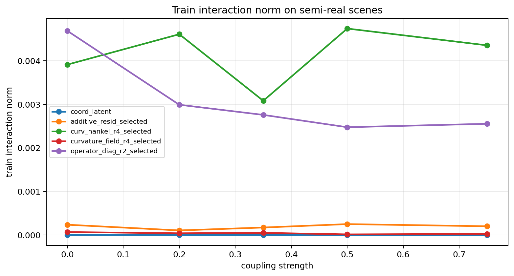

# Semi-Real Transfer Probe

Split strategy: `cartesian_blocks`

## Observations

- `semireal_coupled_0.00`: coupling `0.000000`, coord_latent `0.000125`, additive_resid_selected `0.000190` (l0.005 x1, l0.050 x2), curv_hankel_r4_selected `0.000173` (l0.050 x3), curvature_field_r4_selected `0.000180` (l0.010 x1, l0.050 x2), operator_diag_r2_selected `0.000128` (l0.000 x3).
- `semireal_coupled_0.20`: coupling `0.200000`, coord_latent `0.000120`, additive_resid_selected `0.000197` (l0.020 x2, l0.050 x1), curv_hankel_r4_selected `0.000166` (l0.050 x3), curvature_field_r4_selected `0.000169` (l0.020 x1, l0.050 x2), operator_diag_r2_selected `0.000140` (l0.000 x2, l0.001 x1).
- `semireal_coupled_0.35`: coupling `0.350000`, coord_latent `0.000118`, additive_resid_selected `0.000200` (l0.020 x2, l0.050 x1), curv_hankel_r4_selected `0.000167` (l0.020 x2, l0.050 x1), curvature_field_r4_selected `0.000180` (l0.020 x2, l0.050 x1), operator_diag_r2_selected `0.000141` (l0.000 x3).
- `semireal_coupled_0.50`: coupling `0.500000`, coord_latent `0.000124`, additive_resid_selected `0.000207` (l0.010 x1, l0.020 x2), curv_hankel_r4_selected `0.000184` (l0.020 x1, l0.050 x2), curvature_field_r4_selected `0.000184` (l0.050 x3), operator_diag_r2_selected `0.000156` (l0.000 x1, l0.001 x1, l0.050 x1).
- `semireal_coupled_0.75`: coupling `0.750000`, coord_latent `0.000154`, additive_resid_selected `0.000226` (l0.020 x2, l0.050 x1), curv_hankel_r4_selected `0.000180` (l0.020 x1, l0.050 x2), curvature_field_r4_selected `0.000187` (l0.050 x3), operator_diag_r2_selected `0.000155` (l0.000 x2, l0.010 x1).

## Plots

