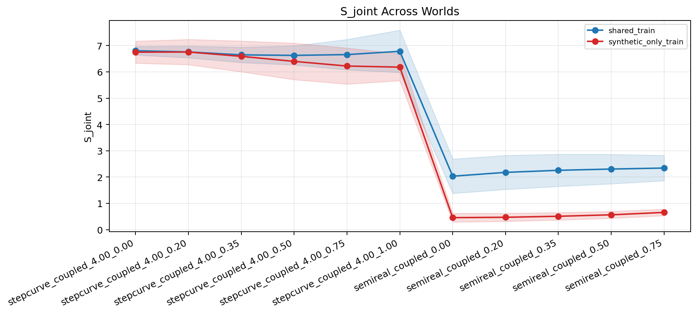
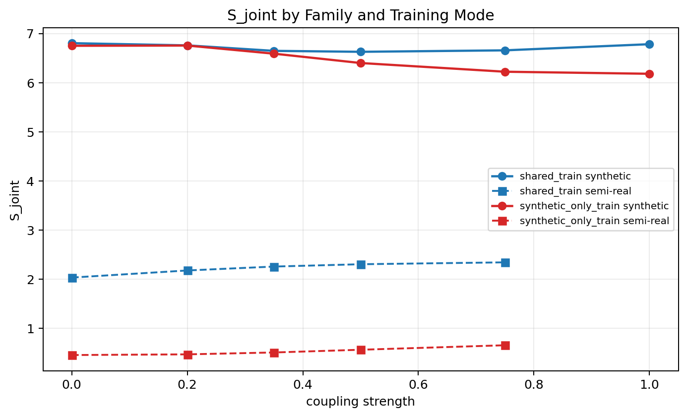

# Shared Latent Score Stability v1

Configuration:
- seeds `17, 29, 43, 71, 101`
- image size `24`
- latent dim `16`
- epochs `140`
- batch size `64`

Main comparison on `S_joint`:
- `shared_train` semi-real sign accuracy `0.60+/-0.49`, pooled sign accuracy `0.82+/-0.22`.
- `synthetic_only_train` semi-real sign accuracy `1.00+/-0.00`, pooled sign accuracy `0.98+/-0.04`.

Plots:

Per-world `S_joint` mean/std:
| world | family | coupling | shared_train | synthetic_only_train | shared recon mse | synthetic-only recon mse |
| --- | --- | ---: | ---: | ---: | ---: | ---: |
| stepcurve_coupled_4.00_0.00 | synthetic | 0.00 | 6.803294+/-0.161747 | 6.749940+/-0.418733 | 0.002414 | 0.002865 |
| stepcurve_coupled_4.00_0.20 | synthetic | 0.20 | 6.758190+/-0.220268 | 6.754772+/-0.479753 | 0.002126 | 0.002554 |
| stepcurve_coupled_4.00_0.35 | synthetic | 0.35 | 6.646607+/-0.290710 | 6.589499+/-0.585054 | 0.002228 | 0.002641 |
| stepcurve_coupled_4.00_0.50 | synthetic | 0.50 | 6.627410+/-0.362809 | 6.399390+/-0.694151 | 0.002492 | 0.002891 |
| stepcurve_coupled_4.00_0.75 | synthetic | 0.75 | 6.657318+/-0.577919 | 6.222219+/-0.685807 | 0.003304 | 0.003625 |
| stepcurve_coupled_4.00_1.00 | synthetic | 1.00 | 6.782334+/-0.804481 | 6.180458+/-0.514904 | 0.004718 | 0.004814 |
| semireal_coupled_0.00 | semi-real | 0.00 | 2.034386+/-0.652998 | 0.458248+/-0.166531 | 0.006381 | 0.409915 |
| semireal_coupled_0.20 | semi-real | 0.20 | 2.179106+/-0.645679 | 0.472435+/-0.154922 | 0.006287 | 0.410225 |
| semireal_coupled_0.35 | semi-real | 0.35 | 2.258372+/-0.611029 | 0.510658+/-0.141840 | 0.006329 | 0.410521 |
| semireal_coupled_0.50 | semi-real | 0.50 | 2.305796+/-0.560023 | 0.566021+/-0.131262 | 0.006464 | 0.410867 |
| semireal_coupled_0.75 | semi-real | 0.75 | 2.344242+/-0.480761 | 0.657637+/-0.122396 | 0.006892 | 0.411531 |
