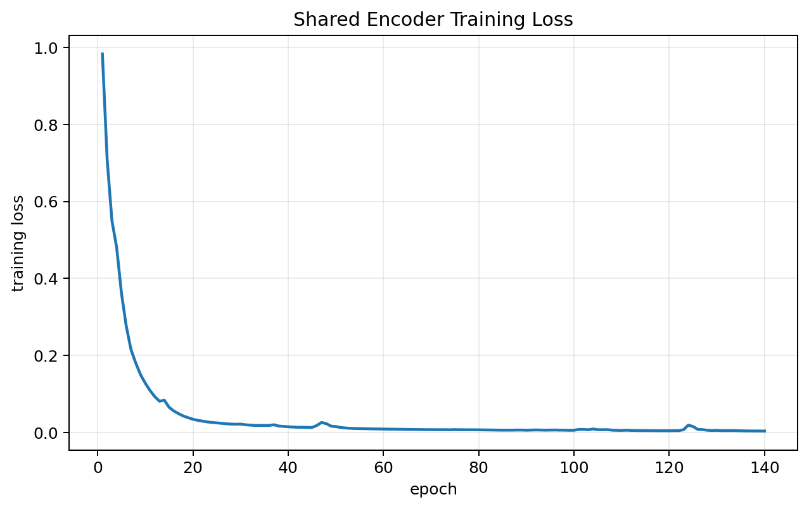
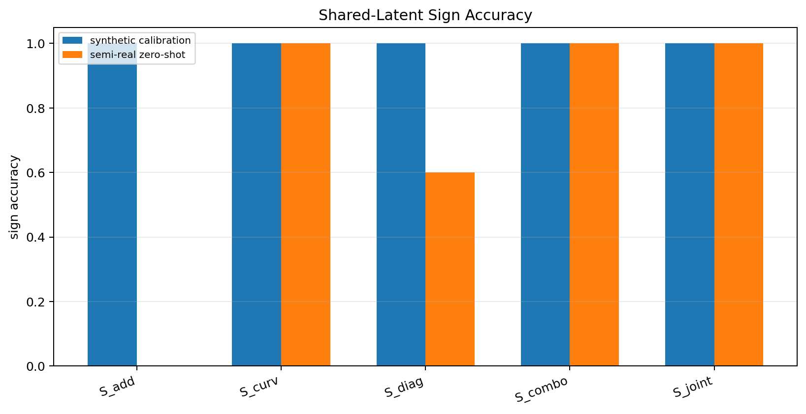
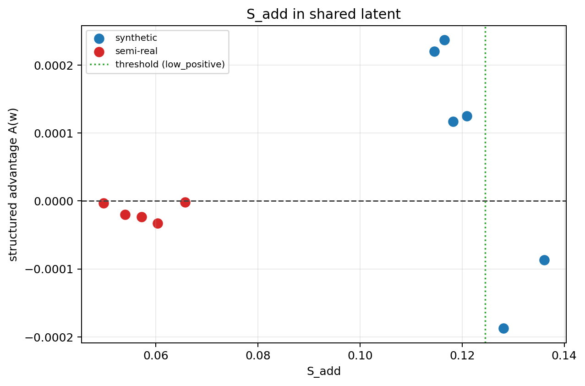
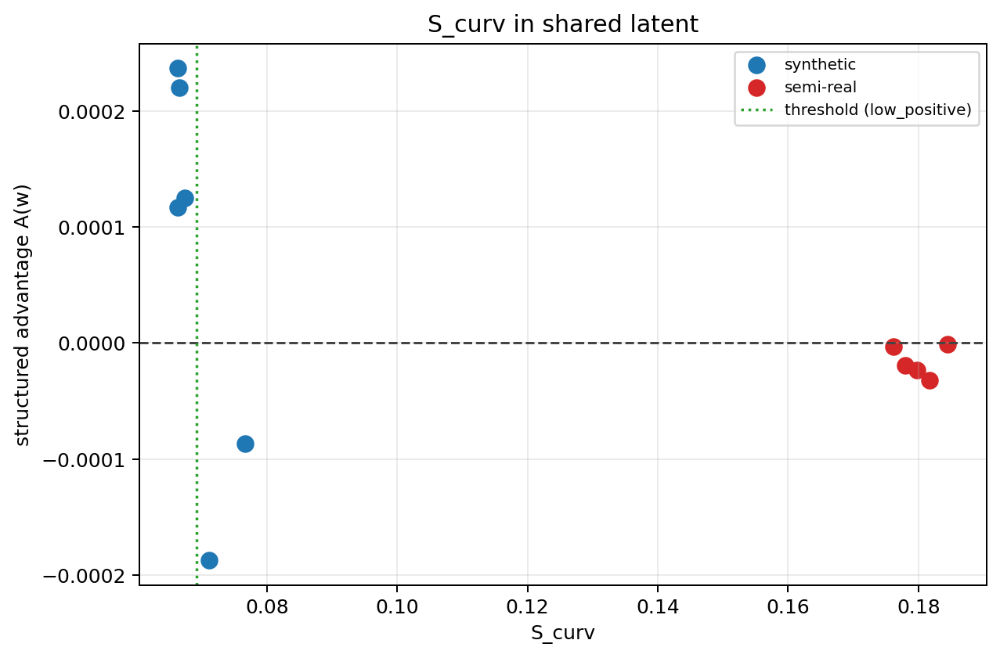
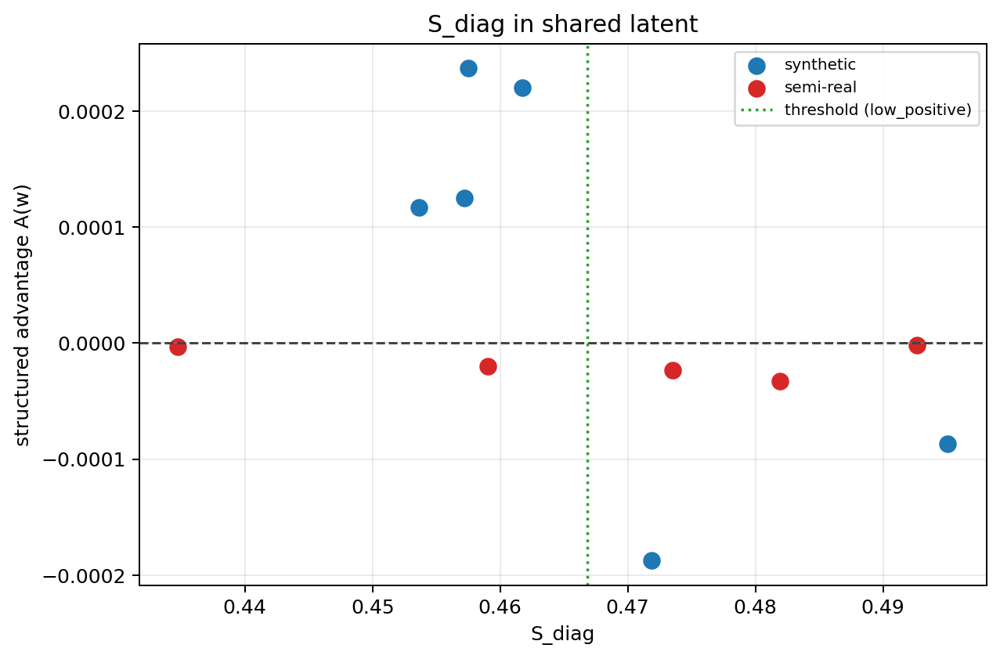
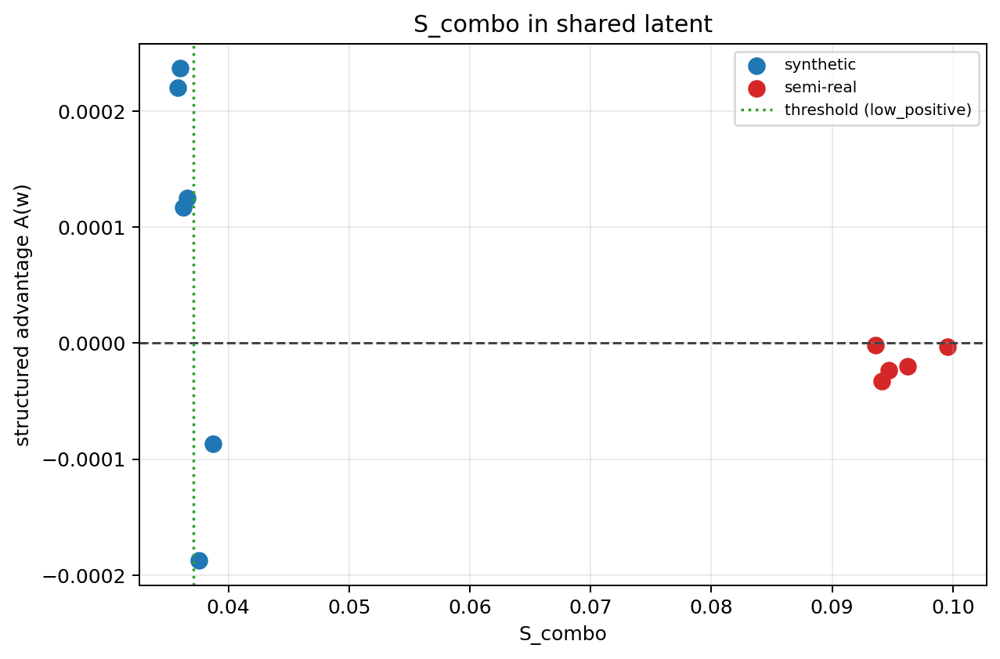
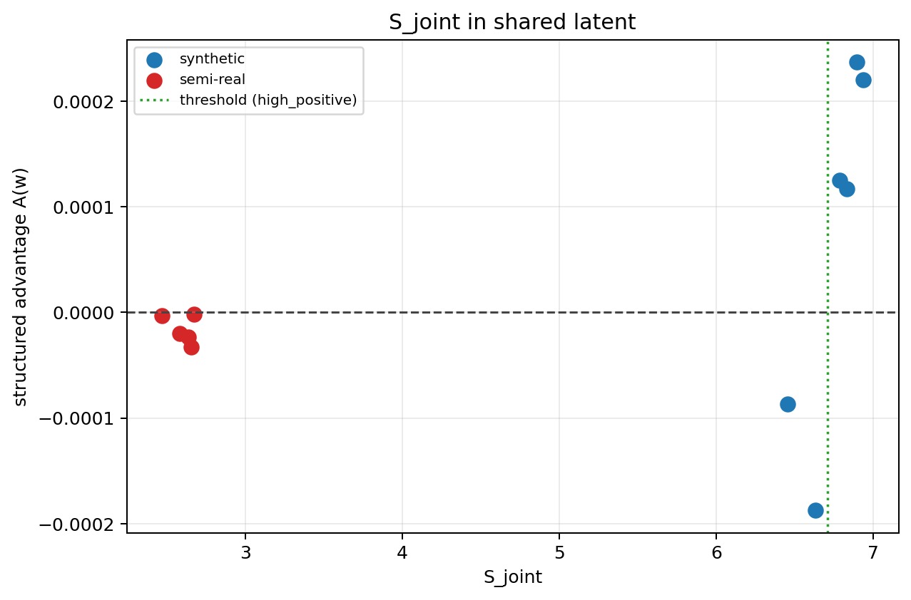

# Shared Latent Score Validation v1

Shared encoder setup:
- image size `24`
- latent dim `16`
- epochs `140`
- batch size `64`
- best train loss `0.003923`

Best latent score:
- `S_joint` with synthetic sign accuracy `1.00`, semi-real zero-shot sign accuracy `1.00`, pooled sign accuracy `1.00`, synthetic Spearman `+0.829`, semi-real Spearman `+0.000`, pooled Spearman `+0.564`.

- Relative to raw-world scores, best semi-real zero-shot sign accuracy changed by +0.80 (raw best `0.20` -> shared best `1.00`).

Per-world shared-latent scores and reconstruction:
| world | coupling | A(w) | shared recon mse | S_add | S_curv | S_diag | S_combo | S_joint |
| --- | ---: | ---: | ---: | ---: | ---: | ---: | ---: | ---: |
| stepcurve_coupled_4.00_0.00 | 0.00 | +0.000220 | 0.002277 | 0.114573 | 0.066538 | 0.461757 | 0.035814 | 6.939722 |
| stepcurve_coupled_4.00_0.20 | 0.20 | +0.000237 | 0.001959 | 0.116494 | 0.066348 | 0.457524 | 0.035992 | 6.895865 |
| stepcurve_coupled_4.00_0.35 | 0.35 | +0.000117 | 0.002051 | 0.118245 | 0.066380 | 0.453632 | 0.036268 | 6.833909 |
| stepcurve_coupled_4.00_0.50 | 0.50 | +0.000125 | 0.002315 | 0.120900 | 0.067371 | 0.457172 | 0.036571 | 6.785872 |
| stepcurve_coupled_4.00_0.75 | 0.75 | -0.000187 | 0.003127 | 0.128076 | 0.071131 | 0.471877 | 0.037566 | 6.633877 |
| stepcurve_coupled_4.00_1.00 | 1.00 | -0.000087 | 0.004620 | 0.136083 | 0.076680 | 0.495082 | 0.038717 | 6.456470 |
| semireal_coupled_0.00 | 0.00 | -0.000003 | 0.006010 | 0.049735 | 0.176165 | 0.434748 | 0.099578 | 2.467845 |
| semireal_coupled_0.20 | 0.20 | -0.000020 | 0.005909 | 0.053958 | 0.177987 | 0.459069 | 0.096279 | 2.579223 |
| semireal_coupled_0.35 | 0.35 | -0.000023 | 0.005942 | 0.057149 | 0.179801 | 0.473509 | 0.094663 | 2.633521 |
| semireal_coupled_0.50 | 0.50 | -0.000032 | 0.006064 | 0.060342 | 0.181663 | 0.481949 | 0.094111 | 2.652978 |
| semireal_coupled_0.75 | 0.75 | -0.000001 | 0.006463 | 0.065668 | 0.184507 | 0.492638 | 0.093612 | 2.670023 |

Plots:

