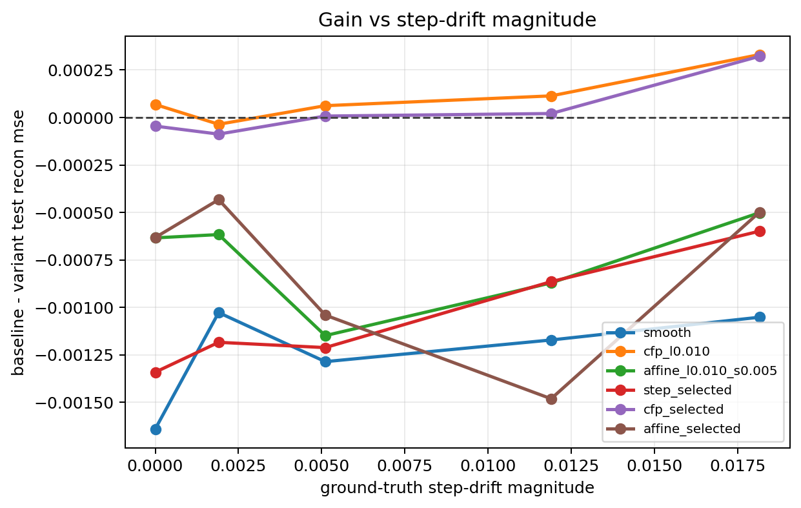
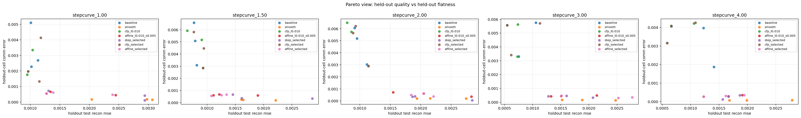

# Step Stationarity Probe

Split strategy: `cartesian_blocks`
Selection mode: `nested`

## Observations

- `stepcurve_1.00`: commutator `0.000000`, step_drift `0.000000`, baseline `0.001053`, cfp_l0.010 `0.000984`, affine_l0.010_s0.005 `0.001687`, step_selected `0.002395` (step_candidate_l0.005 x2, step_candidate_l0.050 x1), cfp_selected `0.001098` (cfp_candidate_l0.005 x1, cfp_candidate_l0.010 x1, cfp_candidate_l0.050 x1), affine_selected `0.001685` (affine_candidate_c0.005_s0.005 x1, affine_candidate_c0.010_s0.005 x1, affine_candidate_c0.020_s0.005 x1).
- `stepcurve_1.50`: commutator `0.000000`, step_drift `0.001905`, baseline `0.000792`, cfp_l0.010 `0.000827`, affine_l0.010_s0.005 `0.001409`, step_selected `0.001976` (step_candidate_l0.005 x1, step_candidate_l0.010 x2), cfp_selected `0.000879` (cfp_candidate_l0.005 x1, cfp_candidate_l0.010 x1, cfp_candidate_l0.020 x1), affine_selected `0.001225` (affine_candidate_c0.005_s0.005 x1, affine_candidate_c0.050_s0.005 x1, affine_candidate_c0.100_s0.005 x1).
- `stepcurve_2.00`: commutator `0.000000`, step_drift `0.005109`, baseline `0.000994`, cfp_l0.010 `0.000932`, affine_l0.010_s0.005 `0.002144`, step_selected `0.002207` (step_candidate_l0.010 x2, step_candidate_l0.100 x1), cfp_selected `0.000987` (cfp_candidate_l0.010 x1, cfp_candidate_l0.020 x1, cfp_candidate_l0.050 x1), affine_selected `0.002035` (affine_candidate_c0.050_s0.005 x1, affine_candidate_c0.050_s0.010 x1, affine_candidate_c0.100_s0.005 x1).
- `stepcurve_3.00`: commutator `0.000000`, step_drift `0.011897`, baseline `0.000786`, cfp_l0.010 `0.000673`, affine_l0.010_s0.005 `0.001658`, step_selected `0.001651` (step_candidate_l0.005 x2, step_candidate_l0.010 x1), cfp_selected `0.000766` (cfp_candidate_l0.020 x1, cfp_candidate_l0.050 x1, cfp_candidate_l0.100 x1), affine_selected `0.002268` (affine_candidate_c0.005_s0.005 x1, affine_candidate_c0.050_s0.010 x1, affine_candidate_c0.100_s0.010 x1).
- `stepcurve_4.00`: commutator `0.000000`, step_drift `0.018160`, baseline `0.001100`, cfp_l0.010 `0.000768`, affine_l0.010_s0.005 `0.001601`, step_selected `0.001699` (step_candidate_l0.005 x2, step_candidate_l0.020 x1), cfp_selected `0.000777` (cfp_candidate_l0.010 x1, cfp_candidate_l0.020 x1, cfp_candidate_l0.050 x1), affine_selected `0.001598` (affine_candidate_c0.005_s0.005 x1, affine_candidate_c0.020_s0.005 x2).

## Plots

