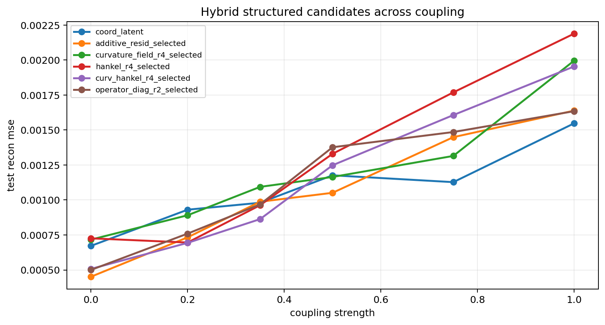
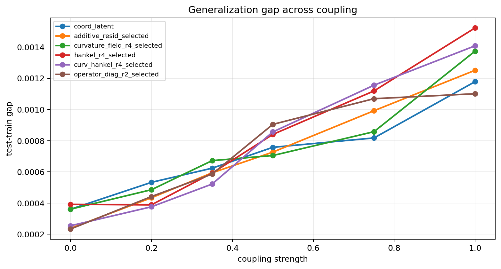
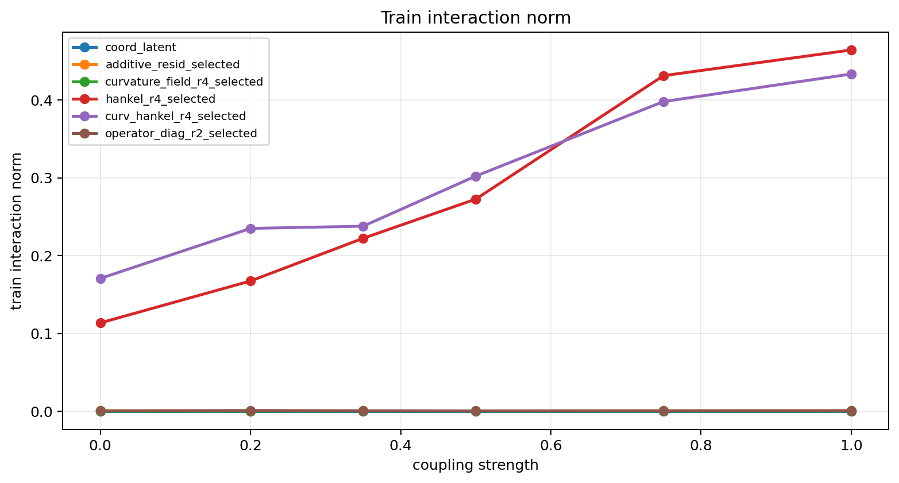

# Structured Hybrid Probe

Gamma: `4.00`
Split strategy: `cartesian_blocks`

## Observations

- `stepcurve_coupled_4.00_0.00`: coupling `0.000000`, coord_latent `0.000672`, additive_resid_selected `0.000452` (l0.020 x1, l0.050 x2), curvature_field_r4_selected `0.000717` (l0.010 x2, l0.050 x1), hankel_r4_selected `0.000726` (l0.005 x2, l0.050 x1), curv_hankel_r4_selected `0.000508` (l0.010 x1, l0.020 x1, l0.050 x1), operator_diag_r2_selected `0.000500` (l0.020 x1, l0.050 x2).
- `stepcurve_coupled_4.00_0.20`: coupling `0.200000`, coord_latent `0.000930`, additive_resid_selected `0.000733` (l0.050 x3), curvature_field_r4_selected `0.000891` (l0.010 x1, l0.020 x1, l0.050 x1), hankel_r4_selected `0.000696` (l0.001 x1, l0.010 x1, l0.020 x1), curv_hankel_r4_selected `0.000694` (l0.000 x1, l0.010 x2), operator_diag_r2_selected `0.000760` (l0.000 x1, l0.005 x1, l0.050 x1).
- `stepcurve_coupled_4.00_0.35`: coupling `0.350000`, coord_latent `0.000980`, additive_resid_selected `0.000987` (l0.050 x3), curvature_field_r4_selected `0.001094` (l0.000 x1, l0.010 x1, l0.020 x1), hankel_r4_selected `0.000962` (l0.001 x1, l0.020 x1, l0.050 x1), curv_hankel_r4_selected `0.000863` (l0.001 x1, l0.020 x2), operator_diag_r2_selected `0.000968` (l0.010 x2, l0.020 x1).
- `stepcurve_coupled_4.00_0.50`: coupling `0.500000`, coord_latent `0.001176`, additive_resid_selected `0.001051` (l0.050 x3), curvature_field_r4_selected `0.001164` (l0.001 x1, l0.020 x1, l0.050 x1), hankel_r4_selected `0.001330` (l0.020 x1, l0.050 x2), curv_hankel_r4_selected `0.001248` (l0.010 x1, l0.020 x1, l0.050 x1), operator_diag_r2_selected `0.001377` (l0.005 x1, l0.010 x1, l0.050 x1).
- `stepcurve_coupled_4.00_0.75`: coupling `0.750000`, coord_latent `0.001127`, additive_resid_selected `0.001449` (l0.050 x3), curvature_field_r4_selected `0.001315` (l0.001 x1, l0.010 x1, l0.020 x1), hankel_r4_selected `0.001769` (l0.010 x3), curv_hankel_r4_selected `0.001606` (l0.000 x1, l0.020 x2), operator_diag_r2_selected `0.001485` (l0.001 x1, l0.005 x1, l0.020 x1).
- `stepcurve_coupled_4.00_1.00`: coupling `1.000000`, coord_latent `0.001547`, additive_resid_selected `0.001638` (l0.050 x3), curvature_field_r4_selected `0.001995` (l0.000 x1, l0.020 x1, l0.050 x1), hankel_r4_selected `0.002188` (l0.005 x1, l0.020 x1, l0.050 x1), curv_hankel_r4_selected `0.001954` (l0.001 x1, l0.010 x1, l0.050 x1), operator_diag_r2_selected `0.001634` (l0.010 x1, l0.020 x1, l0.050 x1).

## Plots

