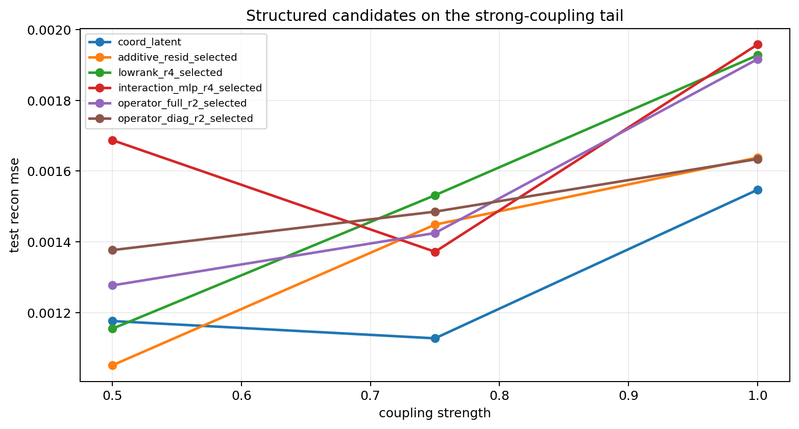
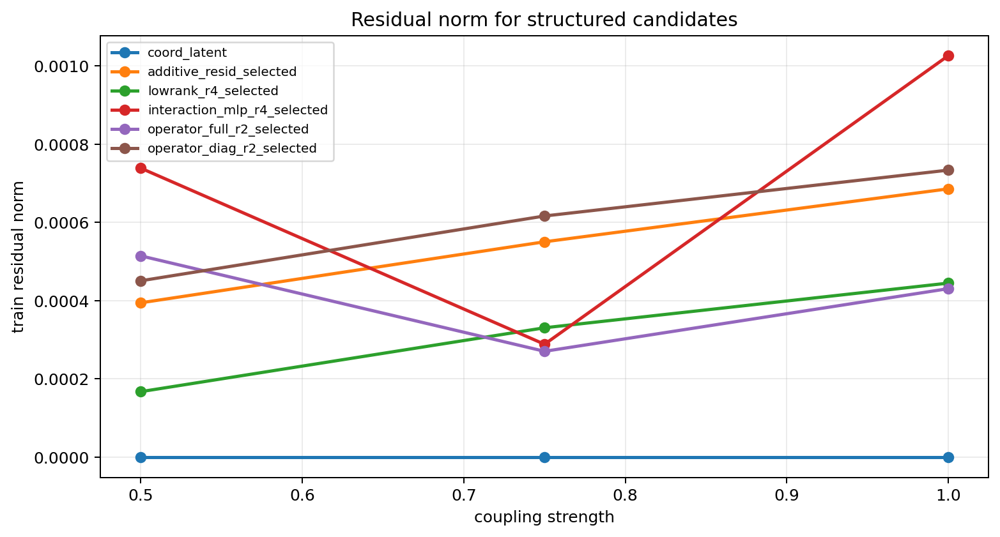

# Structured Tail Candidates Probe

Gamma: `4.00`
Split strategy: `cartesian_blocks`

## Observations

- `stepcurve_coupled_4.00_0.50`: coupling `0.500000`, coord_latent `0.001176`, additive_resid_selected `0.001051` (l0.050 x3), lowrank_r4_selected `0.001155` (l0.050 x3), interaction_mlp_r4_selected `0.001687` (l0.005 x1, l0.010 x1, l0.020 x1), operator_full_r2_selected `0.001277` (l0.010 x1, l0.020 x1, l0.050 x1), operator_diag_r2_selected `0.001377` (l0.005 x1, l0.010 x1, l0.050 x1).
- `stepcurve_coupled_4.00_0.75`: coupling `0.750000`, coord_latent `0.001127`, additive_resid_selected `0.001449` (l0.050 x3), lowrank_r4_selected `0.001532` (l0.020 x1, l0.050 x2), interaction_mlp_r4_selected `0.001372` (l0.050 x3), operator_full_r2_selected `0.001425` (l0.050 x3), operator_diag_r2_selected `0.001485` (l0.001 x1, l0.005 x1, l0.020 x1).
- `stepcurve_coupled_4.00_1.00`: coupling `1.000000`, coord_latent `0.001547`, additive_resid_selected `0.001638` (l0.050 x3), lowrank_r4_selected `0.001928` (l0.010 x1, l0.050 x2), interaction_mlp_r4_selected `0.001958` (l0.010 x1, l0.020 x2), operator_full_r2_selected `0.001916` (l0.020 x1, l0.050 x2), operator_diag_r2_selected `0.001634` (l0.010 x1, l0.020 x1, l0.050 x1).

## Plots

