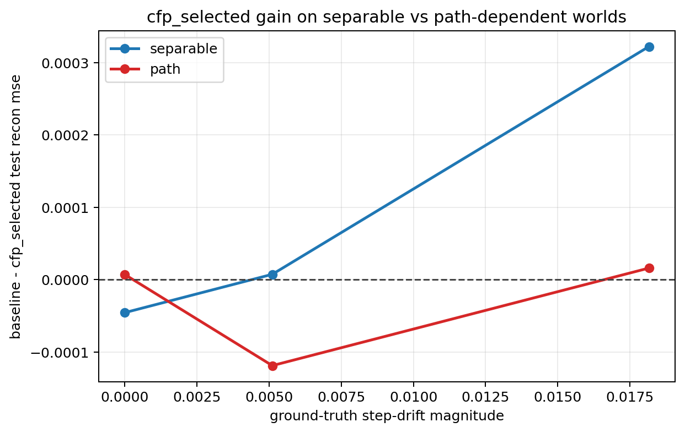
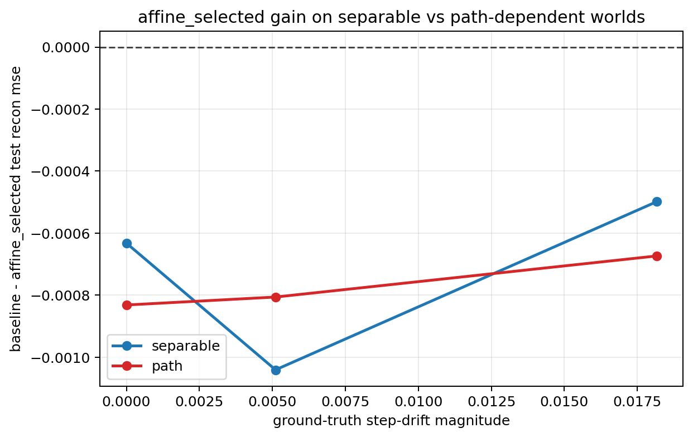
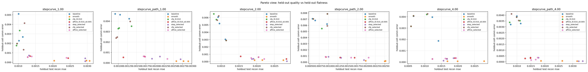

# Transport Pair Probe

Split strategy: `cartesian_blocks`
Selection mode: `nested`

## Observations

- `stepcurve_1.00`: family `separable`, step_drift `0.000000`, commutator `0.000000`, baseline `0.001053`, cfp_l0.010 `0.000984`, affine_l0.010_s0.005 `0.001687`, step_selected `0.002395` (step_candidate_l0.005 x2, step_candidate_l0.050 x1), cfp_selected `0.001098` (cfp_candidate_l0.005 x1, cfp_candidate_l0.010 x1, cfp_candidate_l0.050 x1), affine_selected `0.001685` (affine_candidate_c0.005_s0.005 x1, affine_candidate_c0.010_s0.005 x1, affine_candidate_c0.020_s0.005 x1).
- `stepcurve_path_1.00`: family `path`, step_drift `0.000000`, commutator `0.000564`, baseline `0.001085`, cfp_l0.010 `0.001127`, affine_l0.010_s0.005 `0.001526`, step_selected `0.002250` (step_candidate_l0.005 x2, step_candidate_l0.010 x1), cfp_selected `0.001078` (cfp_candidate_l0.005 x1, cfp_candidate_l0.020 x2), affine_selected `0.001917` (affine_candidate_c0.005_s0.005 x2, affine_candidate_c0.010_s0.005 x1).
- `stepcurve_2.00`: family `separable`, step_drift `0.005109`, commutator `0.000000`, baseline `0.000994`, cfp_l0.010 `0.000932`, affine_l0.010_s0.005 `0.002144`, step_selected `0.002207` (step_candidate_l0.010 x2, step_candidate_l0.100 x1), cfp_selected `0.000987` (cfp_candidate_l0.010 x1, cfp_candidate_l0.020 x1, cfp_candidate_l0.050 x1), affine_selected `0.002035` (affine_candidate_c0.050_s0.005 x1, affine_candidate_c0.050_s0.010 x1, affine_candidate_c0.100_s0.005 x1).
- `stepcurve_path_2.00`: family `path`, step_drift `0.005109`, commutator `0.000558`, baseline `0.000724`, cfp_l0.010 `0.000793`, affine_l0.010_s0.005 `0.001311`, step_selected `0.001425` (step_candidate_l0.005 x2, step_candidate_l0.010 x1), cfp_selected `0.000843` (cfp_candidate_l0.010 x2, cfp_candidate_l0.050 x1), affine_selected `0.001530` (affine_candidate_c0.005_s0.005 x2, affine_candidate_c0.100_s0.005 x1).
- `stepcurve_4.00`: family `separable`, step_drift `0.018160`, commutator `0.000000`, baseline `0.001100`, cfp_l0.010 `0.000768`, affine_l0.010_s0.005 `0.001601`, step_selected `0.001699` (step_candidate_l0.005 x2, step_candidate_l0.020 x1), cfp_selected `0.000777` (cfp_candidate_l0.010 x1, cfp_candidate_l0.020 x1, cfp_candidate_l0.050 x1), affine_selected `0.001598` (affine_candidate_c0.005_s0.005 x1, affine_candidate_c0.020_s0.005 x2).
- `stepcurve_path_4.00`: family `path`, step_drift `0.018160`, commutator `0.000555`, baseline `0.000967`, cfp_l0.010 `0.000945`, affine_l0.010_s0.005 `0.001421`, step_selected `0.002784` (step_candidate_l0.005 x1, step_candidate_l0.050 x2), cfp_selected `0.000951` (cfp_candidate_l0.005 x1, cfp_candidate_l0.010 x1, cfp_candidate_l0.020 x1), affine_selected `0.001641` (affine_candidate_c0.005_s0.005 x1, affine_candidate_c0.010_s0.010 x2).

## Plots

